# 一、操作系统概述

## 硬件和软件

我们所熟知的计算机是由：硬件和软件所组成。

硬件：计算机系统中由电子，机械和光电元件等组成的各种物理装置的总称。

软件：是用户和计算机硬件之间的接口和桥梁，用户通过软件与计算机进行交流。而操作系统，就是软件的一类。

一个完整的计算机：硬件 + 操作系统软件

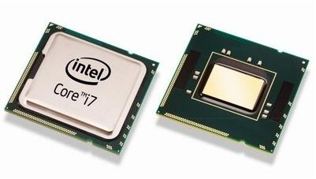

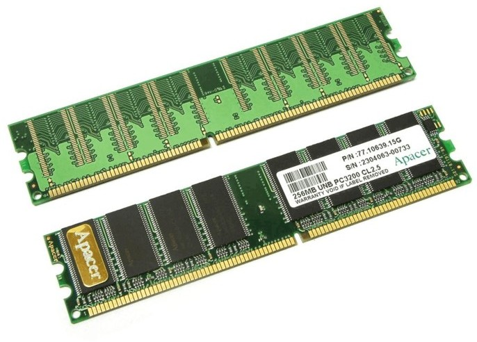

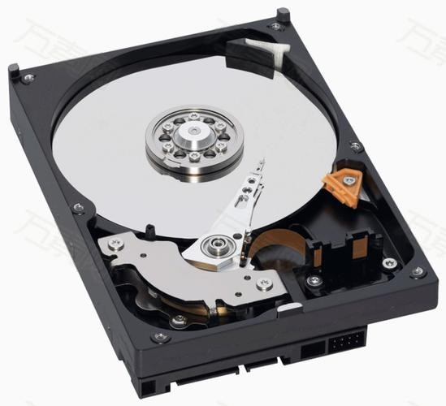

## 操作系统

操作系统是计算机软件的一种，它主要负责：

作为用户和计算机硬件之间的桥梁，调度和管理计算机硬件进行工作。

而计算机，如果没有操作系统，就是一堆无法使用的塑料而已。

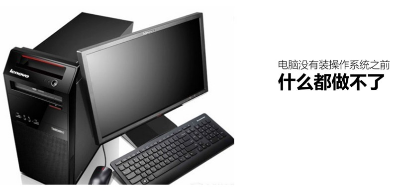

当计算机拥有了操作系统，就相当于拥有了灵魂，操作系统可以：

-   调度CPU 进行工作

-   调度内存进行工作

-   调度硬盘进行数据存储

-   调度网卡进行网络通讯

-   调度音响发出声音

-   调度打印机打印内容

-   \...\...

举例：微信发送消息

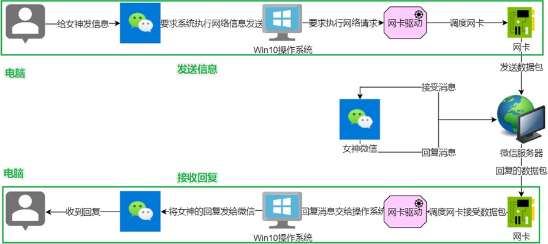

用户使用操作系统，操作系统安排硬件干活

## 常见操作系统

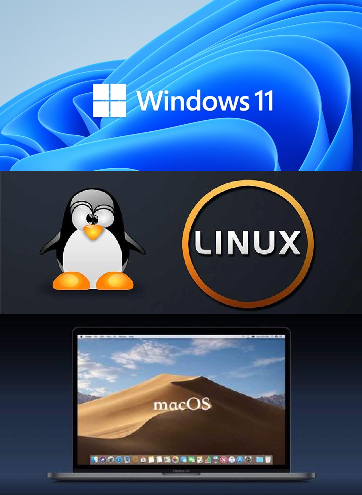

> 不管是 PC 操作系统还是移动操作系统，其功能都是：调度硬件进行工作充当用户和硬件之间的桥梁

## 总结

1. 计算机主要由哪两部分组成

硬件和软件

2. 操作系统是什么？有什么作用？

操作系统是软件的一类

主要作用是协助用户调度硬件工作，充当用户和计算机硬件之间的桥梁

3. 常见的操作系统有哪些

PC 端：Windows、Linux、MacOS

移动端：Android、IOS、鸿蒙系统

# 二、初识Linux

## Linux 的诞生

Linux 创始人 : 林纳斯 托瓦兹

Linux 诞生于 1991 年，作者上大学期间

因为创始人在上大学期间经常需要浏览新闻和处理邮件，发现现有的操作系统不好用，于是他决心自己写一个保护模式下的操作系统，这就是 Linux 的原型。当时他 21 岁，后来经过全世界网友的支持，现在能够兼容多种硬件，成为最为流行的服务器操作系统之一。

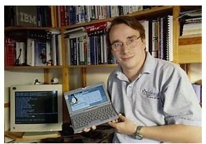  

## Linux 内核

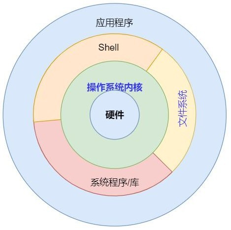

Linux 系统的组成如下：

-   Linux 系统内核：内核提供系统最核心的功能，如：调度 CPU、调度内存、调度文件系统、调度网络通讯、调度 IO 等。
-   系统级应用程序：可以理解为出厂自带程序，可供用户快速上手操作系统，如：文件管理器、任务管理器、图片查看、音乐播放等。

比如，播放音乐，无论用户使用自带音乐播放器或是自行安装的第三方播放器，均是由播放器程序，调用内核提供的相关功能，由内核调度 CPU 解码、音响发声等。

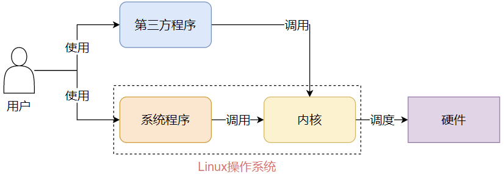

可以看出，内核是 Linux 操作系统最核心的所在，系统级应用程序只是锦上添花。 

Linux 内核是免费开源的，任何人都可以下载内核源码并查看且修改。

可以通过： [https://www.kernel.org](http://www.kernel.org/) 去下载 Linux 内核

## Linux 发行版

内核是免费、开源的，这也就代表了：

-   任何人都可以获得并修改内核，并且自行集成系统级程序

-   提供了内核 + 系统级程序的完整封装，称之为 Linux 发行版

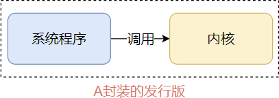

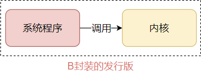

任何人都可以封装 Linux ，目前市面上有非常多的 Linux 发行版，常用的、知名的如下：

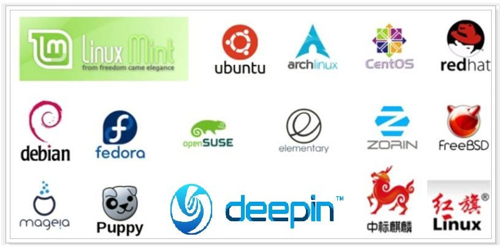本次课程，我们将基于：

-   **主要**基于 CentOS 操作系统进行讲解

-   **辅助**讲解 Ubuntu 系统的相关知识

不同的发行版：

-   基础命令 100% 是相同的
    
-   部分操作不同（如软件安装）

不用纠结选择什么发行版，不论用什么发行版，都是 Linux ，学到的东西都是通用的。

## 总结

1.  Linux 的诞生

Linux 由林纳斯 托瓦兹在 1991 年创立并发展至今成为服务器操作系统领域的核心系统。

2.  什么是 Linux 系统的内核

内核提供了 Linux 系统的主要功能，如硬件调度管理的能力。

Linux 内核是免费开源的，任何人都可以查看内核的源代码，甚至是贡献源代码。

3.  什么是 Linux 系统发行版

内核无法被用户直接使用，需要配合应用程序才能被用户使用。

在内核之上，封装系统级应用程序，组合在一起就称之为 Linux 发行版。发行版众多，课程主要基于 CentOS 辅以Ubuntu 进行讲解

# 三、虚拟机介绍

## 虚拟机

学习Linux 系统，就需要有一个可用的 Linux 系统。

如何获得？将自己的电脑重装系统为 Linux ？

NoNo 。这不现实，因为 Linux 系统并不适合日常办公使用。

我们需要借助虚拟机来获得可用的 Linu 系统环境进行学习。

那么，什么是虚拟机呢？

借助虚拟化技术，我们可以在系统中，通过软件：模拟计算机硬件，并给虚拟硬件安装真实的操作系统。

这样，就可以在电脑中，虚拟出一个完整的电脑，以供我们学习 Linux 系统。

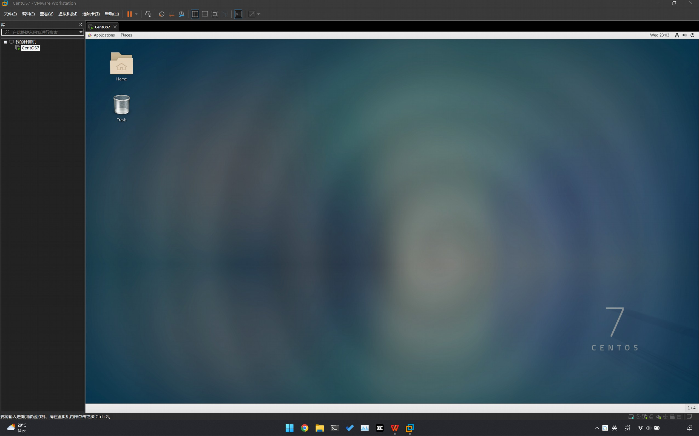

## 总结

1.  什么是虚拟机？

通过虚拟化技术，在电脑内，虚拟出计算机硬件，并给虚拟的硬件安装操作系统，即可得到一台虚拟的电脑，称之为虚拟机。

2.  为什么要使用虚拟机？

学习Linux 系统，需要有 Linux 系统环境。

我们不能给自己电脑重装系统为 Linux ，所以通过虚拟机的形式，得到可以用的Linux 系统环境，供后续学习使用

# 四、VMware WorkStation安装

## 虚拟化软件

通过虚拟化技术，可以虚拟出计算机的硬件，那么如何虚拟呢？

我们可以通过提供虚拟化的软件来获得虚拟机。

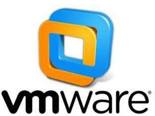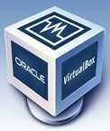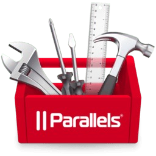

## VMware WorkStation

课程选用VMware WorkStation 软件来提供虚拟机。

下载地址：[https://www.vmware.com/cn/products/workstation-pro.html](http://www.vmware.com/cn/products/workstation-pro.html)

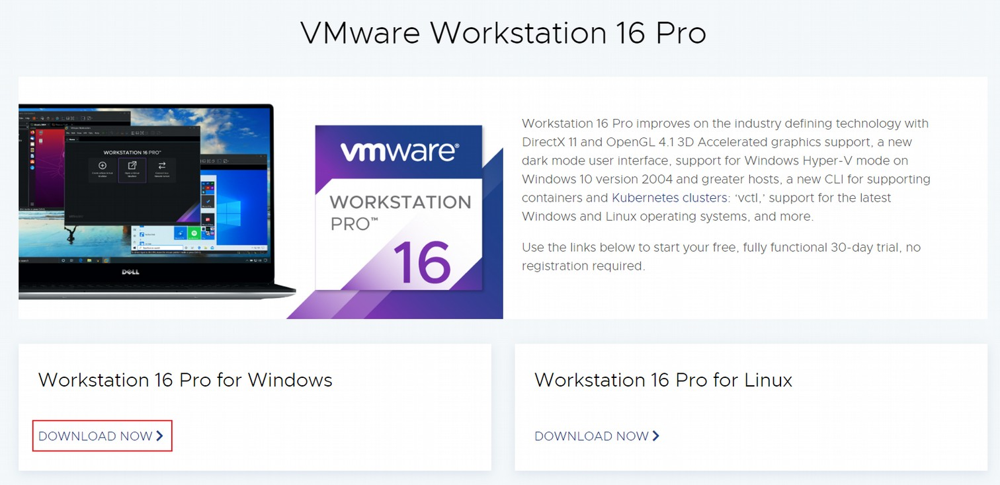

## VMware WorkStation 安装

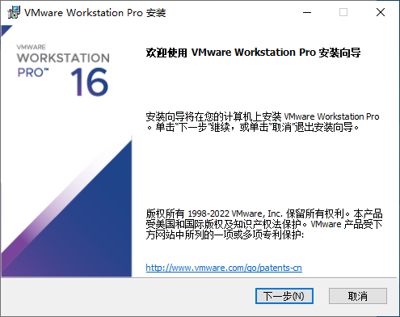

软件安装完成后，验证一下网络适配器是否正常配置。

或者通过快捷键： win + r，输入 ncpa.cpl 回车即可打开

# 五、在VMware上安装Linux

## 下载 CentOS 操作系统

首先需要下载操作系统的安装文件

链接：https://vault.centos.org/7.6.1810/isos/x86_64/ ( 最后的/ 不要漏掉）

选择CentOS-7-x86_64-DVD-1810.iso

或者直接使用如下链接下载：

https://vault.centos.org/7.6.1810/isos/x86_64/CentOS-7-x86_64-DVD-1810.iso

## 在VMware 中安装 CentOS 操作系统

打开VMware 软件

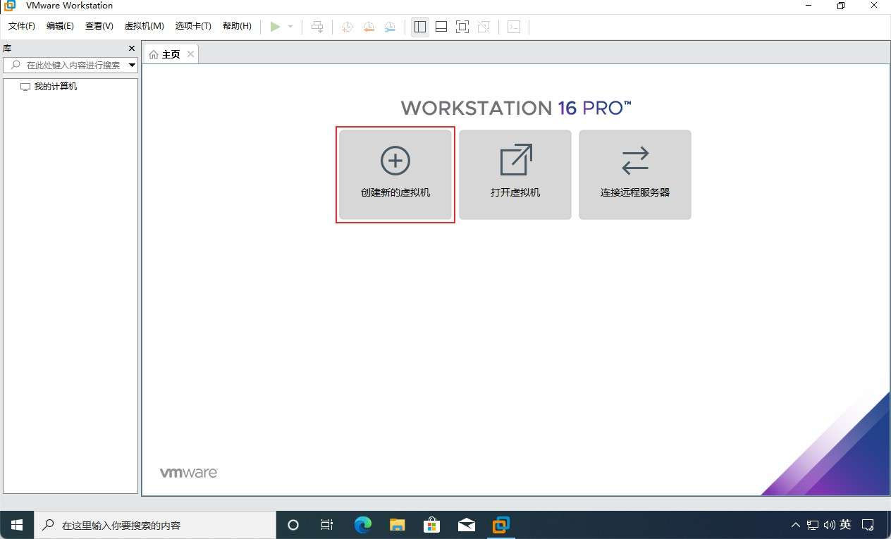

按照步骤创建虚拟机：

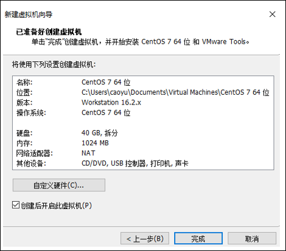

点击完成后，即开启了 CentOS 系统的安装，耐心等待安装完成即可，后续都是自动化的。

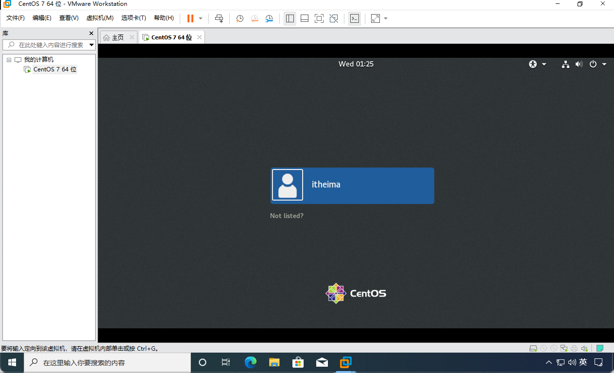

点击用户名：

输入密码：

体验Linux 的快乐吧。

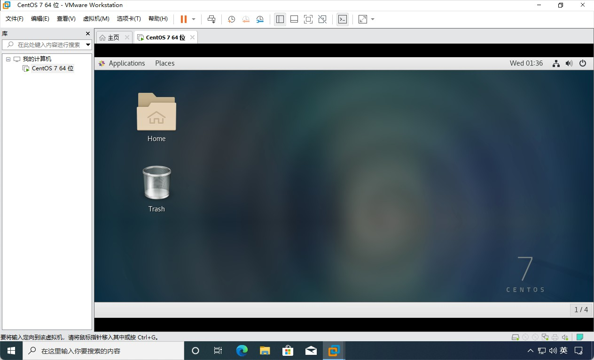

# 六、Mac系统Linux环境

## VMware Fusion

在Windows 系统中使用的 VMware WorkStation 未提供 Mac 版， Mac 系统可以使用 VMware Fusion Pro

Fusion Pro 和 Workstation Pro 均是VMware 公司出品，完全兼容，体验基本是一致的。

下载地址：[https://www.vmware.com/cn/products/fusion.html](http://www.vmware.com/cn/products/fusion.html)

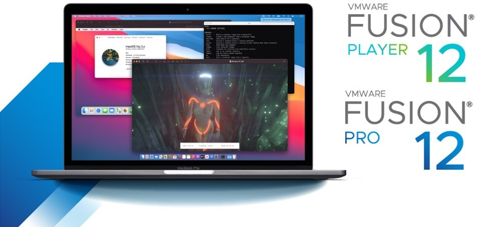

## VMware Fusion Pro 安装

## VMware Fusion Pro 安装 CentOS 系统

首先，我们需要下载操作系统的安装文件，以 CentOS7.6 版本为例：

链接：https://vault.centos.org/7.6.1810/isos/x86_64/ ( 最后的/ 不要漏掉）

选择 CentOS-7-x86_64-DVD-1810.iso

或者直接使用如下链接下载：

https://vault.centos.org/7.6.1810/isos/x86_64/CentOS-7-x86_64-DVD-1810.iso

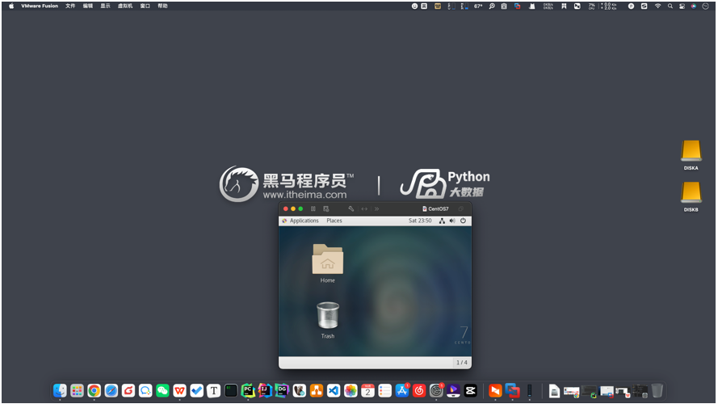

# 七、远程连接Linux系统

# 八、拓展：WSL

## 图形化、命令行

> 对于操作系统的使用，有 2 种使用形式：

-   图形化页面使用操作系统

-   以命令的形式使用操作系统

> 不论是Windows 还是Linux 亦或是MacOS 系统，都是支持这两种使用形式。

-   图形化：使用操作系统提供的图形化页面，以获得**图形化反馈**的形式去使用操作系统。

-   命令行：使用操作系统提供的各类命令，以获得**字符反馈**的形式去使用操作系统。

{width="1.2083333333333333in"
height="1.4986111111111111in"}高级软件人才培训专家

## Windows 系统的图形化和命令行

{width="5.601020341207349in"
height="3.35125in"}

高级软件人才培训专家

## Linux 系统的图形化和命令行

{width="5.999139326334208in"
height="3.590624453193351in"}

> **使用命令行学习 Linux 系统**
>
> 尽管图形化是大多数人使用计算机的第一选择，但是在 Linux
> 操作系统上，这个选择被反转了。
>
> 无论是企业开发亦或是个人开发，使用 Linux
> 操作系统，多数都是使用的：**命令行**。
>
> 这是因为：

-   Linux 从诞生至今，在图形化页面的优化上，并未重点发力。所以 Linux
    操作系统的图形化页面：不好用、不稳定。

-   在开发中，使用命令行形式，效率更高，更加直观，并且资源占用低，程序运行更稳定。

> 所以，后续的课程学习中，我们：

-   除了在少数需要做对照讲解的情况下会使用图形化页面

-   {width="1.269443350831146in"
    height="1.5791655730533682in"}其余都会以命令行的形式去讲解 Linux
    操作系统的使用

## FinalShell

> 既然决定使用命令行去学习 Linux
> 操作系统，那么就必须丰富一下工具的使用。
>
> 我们使用 VMware 可以得到 Linux 虚拟机，但是在 VMware 中操作 Linux
> 的命令行页面不太方便，主要是：

-   内容的复制、粘贴跨越 VMware 不方便

-   文件的上传、下载跨越 VMware 不方便

-   也就是和 Linux 系统的各类交互，跨越 VMware 不方便

> 我们可以通过第三方软件， FinalShell ，远程连接到 Linux 操作系统之上。
>
> 并通过 FinalShell 去操作 Linux 系统。
>
> {width="1.6in"
> height="1.9805555555555556in"}这样各类操作都会十分的方便。

## FinalShell

> FinalShell 的下载地址为： Windows:
>
> {width="1.6347222222222222in"
> height="2.0458333333333334in"}<http://www.hostbuf.com/downloads/finalshell_install.exe>
> Mac:
> <http://www.hostbuf.com/downloads/finalshell_install.pkg>下载完成后双击打开安装。

{width="1.3694444444444445in"
height="1.6805555555555556in"}

## Windows 系统安装 FinalShell

> 按照提示一直下一步即可安装完成。

## Mac 系统安装 FinalShell

> 打开下载的 pkg 文件，按照提示下一步即可安装成功。

{width="1.7638888888888888in"
height="2.2083333333333335in"}高级软件人才培训专家

{width="1.6694444444444445in"
height="1.6805555555555556in"}

## 连接到 Linux 系统

> 首先，先查询到 Linux 系统的 IP 地址

{width="6.166094706911636in"
height="4.617291119860018in"}

{width="1.8249989063867016in"
height="2.0347222222222223in"}

## 连接到 Linux 系统

> 打开Finshell 软件，配置到 Linux 系统的连接（ Mac 和Windows
> 系统的操作一致，不再分开赘述）

{width="8.380124671916011in"
height="1.1354166666666667in"}

{width="6.879370078740157in"
height="2.9184372265966756in"}

## 连接到 Linux 系统

> 按图示配置连接，并点击确定

{width="4.91392716535433in"
height="4.361457786526684in"}

高级软件人才培训专家

## 连接到 Linux 系统

> 打开连接管理器

{width="8.405941601049868in"
height="1.0833333333333333in"}

> 双击刚刚配置好的连接

{width="6.948858267716536in"
height="2.9479166666666665in"}

高级软件人才培训专家

## 连接到 Linux 系统

> 点击接受并保存

{width="3.9068383639545057in"
height="2.1145833333333335in"}

高级软件人才培训专家

## 连接到 Linux 系统

> 如图连接成功
>
> {width="6.0375in"
> height="3.754166666666667in"}**注意：**
>
> **Linux 虚拟机如果重启，有可能，发生 IP 改变**
>
> **如果改变 IP 需要在FinalShell 中修改连接的 IP 地址**
>
> {width="2.136111111111111in"
> height="2.0444444444444443in"}**后面我们会讲解如何固定 IP
> 地址不发生改变**

1.  什么是图形化操作，什么是命令行操作？

-   图形化操作是指使用操作系统附带的图形化页面，以图形化的窗口形式获得操作反馈，从而对操作系统进行操作、使用

-   命令行操作是指使用各种命令，以文字字符的形式获得操作反馈，

2.  为什么 Linux 操作系统要选择命令行形式呢？

-   Linux 操作系统的图形化页面不好用且不稳定

-   使用命令行的形式操作更加高效且稳定资源占用低

-   企业和开发者都选择命令行，所以我们也学习命令行

3.  为什么使用 FinalShell 连接 Linux 去使用

-   操作 Linux 系统中间跨越 VMware 窗口会导致交互不太方便

-   我们只需要使用命令行无需使用图形化，所以通过命令行远程连接使用即可

-   在 Linux 操作系统中，桌面空白右键点击： open in terminal

-   输入 ifconfig ，即可看到IP 地址

-   在FinalShell 中配置好IP 地址，账号密码后即可连接成功

# 目录

> Contents

# 学习目标

> Learning Objectives
>
> 1\. 掌握使用 WSL 获得 Ubuntu 系统环境

{width="1.5791666666666666in"
height="1.8111111111111111in"}

## {width="5.0680555555555555in" height="2.522221128608924in"}说明

> WSL 章节仅仅作为扩展章节，并不是学习重点。
>
> 主要目的是扩展同学们的知识面，可以更简单、更轻松的获得 Linux
> 操作系统环境。
>
> 同时基于 WSL 我们可以得到 Ubuntu 发行版环境，可以拓展除 CentOS
> 发行版之外的额外体验和知识。
>
> 课程后续的学习中，依旧是以 VMware 虚拟机中创建的 CentOS
> 操作系统环境为主。部分内容会以 WSL 中得到的 Ubuntu
> 环境为辅（非重点知识、可跳过）

{width="1.55in" height="1.8111111111111111in"}

## 为什么要用 WSL

> WSL 作为 Windows10
> 系统带来的全新特性，正在逐步颠覆开发人员既有的选择。

-   传统方式获取 Linux 操作系统环境，是安装完整的虚拟机，如 VMware

-   使用 WSL ，可以以非常轻量化的方式，得到 Linux 系统环境

> 目前，开发者正在逐步抛弃以虚拟机的形式获取 Linux
> 系统环境，而在逐步拥抱 WSL 环境。
>
> 所以，课程也紧跟当下趋势，为同学们讲解如何使用 WSL ，简单、快捷的获得
> Linux 系统环境。所以，为什么要用 WSL ，其实很简单：

-   开发人员都在用，大家都用的，我们也要学习

-   实在是太方便了，简单、好用、轻量化、省内存

## 什么是 WSL

> WSL ： Windows Subsystem for Linux ，是用于 Windows 系统之上的 Linux
> 子系统。
>
> 作用很简单，可以在 Windows 系统中获得 Linux
> 系统环境，并完全直连计算机硬件，无需通过虚拟机虚拟硬件。
>
> 简而言之：
>
> Windows10 的WSL 功能，可以无需单独虚拟一套硬件设备
>
> 就可以直接使用主机的物理硬件，构建 Linux 操作系统
>
> 并不会影响 Windows 系统本身的运行

高级软件人才培训专家

## WSL 部署

-   WSL 是 Windows10 自带功能，需要开启，无需下载

{width="1.875in"
height="1.697283464566929in"}{width="1.6999989063867016in"
height="2.488888888888889in"}**3**

高级软件人才培训专家

## WSL 部署

> 点击确定后会进行部署
>
> {width="4.497221128608924in"
> height="3.097930883639545in"}最后重启即可。

{width="5.251701662292214in"
height="1.2333333333333334in"}

高级软件人才培训专家

## WSL 部署

-   {width="2.0in"
    height="0.9166666666666666in"}打开 Windows 应用商店

高级软件人才培训专家

{width="1.6263888888888889in"
height="1.8111111111111111in"}

## WSL 部署

> 点击获取并安装

{width="5.046847112860893in"
height="2.84375in"}{width="4.176388888888889in"
height="0.8958333333333334in"}

{width="2.1527777777777777in"
height="2.0902777777777777in"}

## WSL 部署

> 点击启动

{width="6.4200699912510935in"
height="4.706666666666667in"}

{width="1.8111100174978128in"
height="1.7583333333333333in"}

## WSL 部署

> 输入用户名用以创建一个用户：

{width="8.447222222222223in"
height="0.9479166666666666in"}

> 输入两次密码确认（注意，输入密码没有反馈，不用理会，正常输入即可）

{width="8.405555555555555in" height="1.125in"}

## WSL 部署

> 至此，得到了一个可用的 Ubuntu 操作系统环境

{width="8.751397637795275in"
height="4.39437445319335in"}

高级软件人才培训专家

{width="2.9402777777777778in" height="3.025in"}

## 安装 Windows Terminal 软件

> Ubuntu 自带的终端窗口软件不太好用，我们可以使用微软推出的： Windows
> Terminal 软件在应用商店中搜索 terminal 关键字，找到 Windows Terminal
> 软件下载并安装

{width="6.265625546806649in"
height="3.7502077865266843in"}

## 安装 Windows Terminal 软件

高级软件人才培训专家

## 安装 Windows Terminal 软件

> 再次打开 Windows Terminal 软件，即默认使用 Ubuntu 系统了（ WSL ）

高级软件人才培训专家

> 补充：关于后续学习的环境选择

## Windows 系统学习的环境选择

> 首先：

-   无论是基于VMware Workstation 软件构建的CentOS Linux 环境

-   或者是WSL 获得的Ubuntu Linux 环境

-   均满足课程学习需求（不管是 CentOS 还是Ubuntu ，命令是通用的）

> 课程推荐大家使用 VMware WorkStation 内构建的CentOS Linux 环境进行学习
>
> 因为 WSL
> 虽然好用，但是是直连我们自己的电脑的，如果误操作可能带来重要文件的丢失甚至损坏系统。所以，在虚拟机内操作最好，虚拟机内怎么折腾都行，不会影响自己的电脑的。
>
> WSL 作为一个备用，等同学们熟练 Linux 的使用后，在去尝试重度使用。

## Mac 系统学习的环境选择

> 对于 Mac 系统的同学，同样可以有 2 种Linux 环境可用

-   基于VMware Fusion 构建的 CentOS 虚拟机（和 Windows
    系统的没有任何区别，一样用）

-   基于 Mac 系统本身的终端提供 Linux 命令行环境

    -   Mac 系统是基于 Unix 系统内核的操作系统，其和 Linux
        > 基础操作命令是 100% 兼容的

    -   课程中学习的 Linux 命令，都可以在 Mac 系统中正常运行

> {width="5.370833333333334in"
> height="3.4055555555555554in"}使用Mac 系统的同学，推荐使用 VMware
> Fusion 构建的CentOS Linux 系统进行学习
>
> 因为，尽管 Mac 本身的终端可以 100% 兼容上课的内容，但是
>
> 毕竟是学习，如果因为练习命令而导致电脑重要文件被删除、损坏，系统出现问题
>
> 就得不偿失了。
>
> 所以，在虚拟机内的环境进行练习是最好的，无论怎么折腾都不会影响自己的电脑。

# 目录

> Contents

# 学习目标

> Learning Objectives

1.  掌握虚拟机快照的制作和还原

## 虚拟机快照

> 在学习阶段我们无法避免的可能损坏 Linux 操作系统。
>
> 如果损坏的话，重新安装一个 Linux 操作系统就会十分麻烦。
>
> VMware 虚拟机（ Workstation 和Funsion ）支持为虚拟机制作快照。
>
> 通过快照将当前虚拟机的状态保存下来，在以后可以通过快照恢复虚拟机到保存的状态。

高级软件人才培训专家

## 在VMware Workstation Pro 中制作并还原快照

> **在VMware Fusion Pro 中制作并还原快照**
>
> 快照制作需要虚拟机关机状态下（不关机也可以，但是比较慢，建议关机）

1.  快照有什么作用？

> 快照可以保存虚拟机的状态， 当虚拟机出现问题的时候， 可以通过预

2.  VMware Workstation 和 VMware Fusion 都支持制作快照去使用

> {width="2.4960629921259843in"
> height="1.030207786526684in"}
