# 一、Linux的目录结构

## Linux 的目录结构

Linux 的目录结构是一个树型结构

Windows 系统可以拥有多个盘符 , 如 C 盘、 D 盘、 E 盘

Linux 没有盘符这个概念 , 只有一个根目录 /, 所有文件都在它下面

## Linux 路径的描述方式

-   在 Linux 系统中，路径之间的层级关系，使用： / 来表示

-   在Windows 系统中，路径之间的层级关系，使用： \\ 来表示

> D:\\data\\work\\hello.txt 
>
> 注意：
>
> -   D: 表示D 盘
>
> -   \ 表示层级关系

> /usr/local/hello.txt
>
> 注意：
>
> -   开头的 / 表示根目录
>
> -   后面的 / 表示层级关系

## 总结

1. Linux操作系统的目录结构

Linux 只有一个顶级目录，称之为：根目录

Windows 系统有多个顶级目录，即各个盘符

2\. / 在Linux 系统中表示

-   出现在开头的 / 表示：根目录

-   出现在后面的 / 表示：层次关系

## 课后练习

请根据语言描述，写出对应的 Linux 路径

-   在根目录下有一个文件夹 test ，文件夹内有一个文件 hello.txt，请描述文件的路径

/test/hello.txt

-   在根目录下有一个文件 itheima.txt ，请描述文件的路径

/itheima.txt

-   在根目录下有一个文件夹 itcast ，在itcast 文件夹内有文件夹 itheima，在 itheima 文件夹内有文件hello.txt ，请描述文件的路径

/itcast/itheima/hello.txt

# 二、Linux命令入门

## Linux 命令基础

### 什么是命令、命令行

学习Linux，本质上是学习在命令行下熟练使用Linux的各类命令

* 命令行：即Linux终端（Terminal），是一种命令提示符页面。以纯“字符”的形式操作系统，可以使用各种字符化命令对系统发出操作指令
* 命令：即Linux程序。一个命令就是一个Linux程序。命令没有图形化页面，可以在命令行（终端中）提供字符化的反馈

### Linux 命令基础格式

无论是什么命令，用于什么用途，在 Linux 中，命令有其通用的格式：

> command [-options] [parameter]

-   command ： 命令本身

-   -options ： \[ 可选，非必填 \]命令的一些选项，可以通过选项控制命令的行为细节
    
-   parameter ： \[ 可选，非必填 \] 命令的参数，多数用于命令的指向目标等

语法中的 \[\] ，表示可选的意思

示例：

* ls -l /home/itheima，ls是命令本身，-l是选项，/home/itheima是参数
  * 意思是以列表的形式，显示/home/itheima目录内的内容
* cp -r test1 test2，cp是命令本身，-r是选项，test1和test2是参数
  * 意思是复制文件夹test1成为test2

### 总结

1. 什么是命令、命令行

* 命令：即Linux操作指令，是系统内置的程序，可以以字符化的形式去使用
* 命令行：即Linux终端，可以提供字符化的操作页面供命令执行

2. Linux命令的通用格式

`command [-options] [parameter]`

* 命令本体，即命令本身
* 命令选项，控制命令的行为细节
* 可选参数，控制命令的指向目标

## ls命令入门

### ls 命令

ls 命令的作用是列出目录下的内容，语法细节如下：

`ls [-a -l -h] [Linux路径]`

-   -a -l -h 是可选的选项

-   Linux 路径是此命令可选的参数

当不使用选项和参数，直接使用 ls 命令本体，表示：以平铺形式，列出当前工作目录下的内容

### HOME 目录和工作目录

直接输入 ls 命令，表示列出当前工作目录下的内容，当前工作目录是？ 

Linux 系统的命令行终端，在启动的时候，默认会加载 :

-   当前登录用户的 HOME 目录作为当前工作目录，所以 ls 命令列出的是 HOME 目录的内容
    
-   HOME 目录：每个 Linux 操作用户在 Linux 系统的个人账户目录，路径在：/home/ 用户名
    -   如，图中的 Linux 用户是 itheima ，其 HOME 目录是： /home/itheima

    -   Windows 系统和 Linux 系统，均设有用户的 HOME 目录，如图：

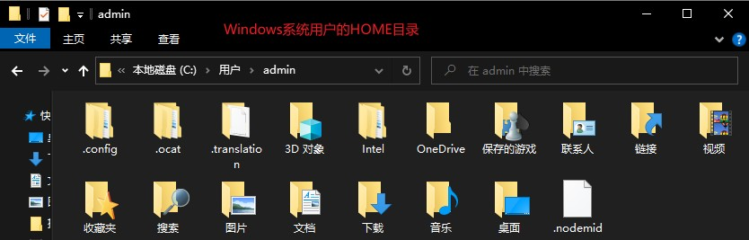

### 总结

1. ls 命令的作用是？

在命令行中，以平铺的形式，展示当前工作目录（默认HOME目录）下的内容（文件或文件夹）

2. HOME目录是？

每一个用户在 Linux 系统的专属目录，默认在：/home/用户名

3. 当前工作目录？

Linux 命令行在执行命令时，需要一个工作目录，打开命令行程序（终端）默认设置工作目录在用户的 HOME 目录

## ls命令的参数和选项

### ls 命令的参数

刚刚展示了，直接使用 ls 命令，并未使用选项和参数。

`ls [-a -l -h] [Linux路径]`

那么 ls 的选项和参数具体有什么作用呢？首先我们先来看参数。

-   当ls 不使用参数，表示列出：当前工作目录的内容，即用户的 HOME 目录

-   当使用参数， ls 命令的参数表示：指定一个 Linux 路径，列出指定路径的内容

如：

通过 ls / 列出了根目录的内容，我们可以打开 VMware ，在Linux 的图形化中对照一下

对照一下命令行的结果和图形化查看的结果：

### ls 命令的 -a 选项

如下语法， ls 命令是可以使用选项的

`ls [-a -l -h] [Linux路径]`

-a 选项，表示： all 的意思，即列出全部文件（包含隐藏的文件 / 文件夹)

可以看到， ls -a 对比 ls 列出的内容更多了。

-   图中以 . 开头的，表示是 Linux 系统的隐藏文件 / 文件夹（只要以 . 开头，就能自动隐藏）
    
-   只有通过 -a 选项，才能看到这些隐藏的文件 / 文件夹

### ls 命令的 -l 选项

`ls [-a -l -h] [Linux路径]`

-l 选项，表示：以列表（竖向排列）的形式展示内容，并展示更多信息

> -l 选项其实和图形化中，文件夹以列表形式排列是一个意思

### ls 命令选项的组合使用

语法中的选项是可以组合使用的，比如学习的 -a 和 -l 可以组合应用。

写法：

-   ls -l -a

-   ls -la

-   ls -al

> 上述三种写法，都是一样的，表示同时应用 -l 和 -a 的功能

### ls 选项和参数的组合使用

除了选项本身可以组合以外，选项和参数也可以一起使用。

### ls 命令的 -h 选项

`ls [-a -l -h] [Linux路径]`

-   -h 表示以易于阅读的形式，列出文件大小，如 K 、 M 、 G
    
-   -h 选项必须要搭配 -l 一起使用

使用 -h 选项后：

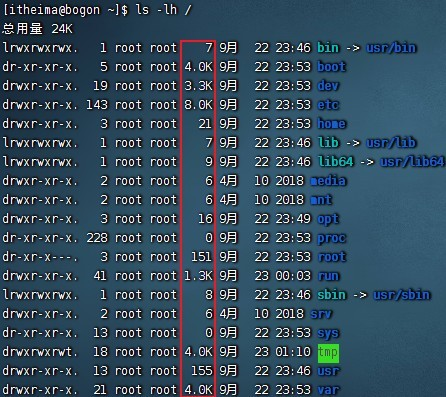

### 总结

1. ls命令的参数和作用

可以指定要查看的文件夹（目录）的内容，如果不指定参数，就查看当前工作目录的内容

2. ls命令的选项：

* -a 选项，可以显示出隐藏的内容
  * 以 . 开头的文件或文件夹默认被隐藏，需要 -a 才能显示出来
* -l 选项，以列表的形式展示内容，并展示更多细节
* -h 选项，需要和 -l 选项搭配使用，以更加人性化的方式显示文件的大小单位
  更易读的大小显示

3. 命令的选项组合使用

命令的选项是可以组合使用的，比如：ls -lah，等同于 ls -a -l -h

# 三、目录切换相关命令（cd/pwd）

## cd 切换工作目录

当 Linux 终端（命令行）打开的时候，会默认以用户的 HOME 目录作为当前的工作目录

我们可以通过 cd 命令，更改当前所在的工作目录。

cd 命令来自英文： Change Directory

语法：

`cd [Linux路径]`

-   cd 命令无需选项，只有参数，表示要切换到哪个目录下

-   cd 命令直接执行，不写参数，表示回到用户的 HOME 目录

## pwd 查看当前工作目录

通过ls 来验证当前的工作目录，其实是不恰当的。

我们可以通过 pwd 命令，来查看当前所在的工作目录。 

pwd 命令来自： Print Work Directory

语法：`pwd`

-   pwd 命令，无选项，无参数，直接输入 pwd 即可

## 总结

1.  cd 命令的作用

-   cd 命令来自英文： Change Directory

-   cd 命令可以切换当前工作目录，语法是：`cd [Linux路径]`
    -   没有选项，只有参数，表示目标路径
    
    -   使用参数，切换到指定路径
    
    -   不使用参数，切换工作目录到当前用户的 HOME

2.  pwd 命令的作用

-   pwd 命令来自英文： Print Work Directory

-   pwd 命令，没有选项，没有参数，直接使用即可

-   作用是：输出当前所在的工作目录

# 四、相对路径、绝对路径和特殊路径符

## 相对路径和绝对路径

如图，通过 pwd 得知当前所在是 HOME 目录： /home/itheima

现在想要通过 cd 命令，切换工作目录到 Desktop 文件夹中去。

那么， cd 命令的参数（ Linux 路径）如何写呢？

-   cd /home/itheima/Desktop

-   cd Desktop

上述两种写法，都可以正确的切换目录到指定的 Desktop 中。

## 相对路径和绝对路径

-   cd /home/itheima/Desktop				绝对路径写法

* cd Desktop												相对路径写法

绝对路

绝对路径：以**根目录为起点**，描述路径的一种写法，路径描述以 / 开头

相对路径：以**当前目录为起点**，描述路径的一种写法，路径描述无需以 / 开头

## 特殊路径符

如图，当前工作目录处于： /home/itheima/Desktop

现在想要，向上回退一级，切换目录到 /home/itheima 中，如何做？

-   可以直接通过 cd ，即可回到 HOME 目录

-   也可以通过特殊路径符来完成。

特殊路径符：

> * .	表示当前目录，比如 cd ./Desktop 表示切换到当前目录下的 Desktop 目录内，和 cd Desktop 效果一致
> * ..   表示上一级目录，比如： cd .. 即可切换到上一级目录， cd ../.. 切换到上二级的目录
> * \~   表示 HOME 目录，比如 cd \~ 即可切换到 HOME 目录或 cd \~/Desktop，切换到 HOME 内的 Desktop 目录

## 总结

1.  相对路径和绝对路径

-   绝对路径：以根目录做起点，描述路径的方式，路径以 / 开头
-   相对路径：以当前目录做起点，描述路径的方式，路径不需以 / 开头

2.  特殊路径符有哪些？

-   . 表示当前目录，比如 cd . 或 cd ./Desktop

-   .. 表示上一级目录，比如： cd .. 或 cd ../..

-   \~ 表示用户的 HOME 目录，比如： cd \~ 或 cd \~/Desktop

## 课后练习

请根据语言描述，写出对应的路径

1. 当前工作目录内有一个 test 文件夹，文件夹内有一个文件 hello.txt，请描述文件的相对路径
   -   test/hello.txt

2. 在当前工作目录的上级目录有一个 test 文件夹，文件夹内有一个文件 hello.txt ，请描述文件的相对路径
   * ../test/hello.txt

3. 在 HOME 目录内有一个 test 文件夹，文件夹内有一个文件 hello.txt，请描述文件的路径，需要使用符号\~
   * ~/test/hello.txt

# 五、创建目录命令（mkdir）

## mkdir 命令

通过 mkdir 命令可以创建新的目录（文件夹）

mkdir 来自英文： Make Directory

语法：`mkdir [-p] Linux路径`

-   参数必填，表示 Linux 路径，即要创建的文件夹的路径，相对路径或绝对路径均可
    
-   -p 选项可选，表示自动创建不存在的父目录，适用于创建连续多层级的目录

## mkdir -p 选项

如果想要一次性创建多个层级的目录，如下图

会报错，因为上级目录 itcast 和good 并不存在，所以无法创建 666 目录

可以通过 -p 选项，将一整个链条都创建完成。

> 注意：创建文件夹需要修改权限，请确保操作均在 HOME 目录内，不要在 HOME 外操作
> 
>涉及到权限问题， HOME 外无法成功

## 总结

1.  mkdir 命令的语法和功能

-   mkdir 用以创建新的目录（文件夹）

-   语法：`mkdir [-p] Linux路径`
    
-   参数必填，表示要创建的目录的路径，相对、绝对、特殊路径符都可以使用

2.  -p 选项的作用

-   可选，表示自动创建不存在的父目录，适用于创建连续多层级的目录

课后练习：

请通过命令在 HOME 目录内，创建如下路径（需使用特殊符号 \~ ）：itcast/itheima/nice/666

* mkdir -p \~/itcast/itheima/nice/666

# 六、文件操作命令（touch、cat、more）

## touch 创建文件

可以通过 touch 命令创建文件

语法：`touch Linux路径`

-   touch 命令无选项，参数必填，表示要创建的文件路径，相对、绝对、特殊路径符均可以使用

## cat 命令 查看文件内容

有了文件后，我们可以通过 cat 命令查看文件的内容。

不过，现在我们还未学习 vi 编辑器，无法向文件内编辑内容，所以，暂时我们先通过图形化

在图形化中，手动向文件内添加内容，以测试 cat 命令

准备好文件内容后，可以通过 cat 查看内容。

语法：`cat Linux路径`

-   cat 同样没有选项，只有必填参数，参数表示：被查看的文件路径，相对、绝对、特殊路径符都可以使用

## more 命令查看文件内容

more 命令同样可以查看文件内容，同 cat 不同的是：

-   cat 是直接将内容全部显示出来

-   more 支持翻页，如果文件内容过多，可以一页页的展示

语法：`more Linux路径`

-   同样没有选项，只有必填参数，参数表示：被查看的文件路径，相对、绝对、特殊路径符都可以使用

Linux 系统内置有一个文件，路径为： /etc/services ，可以使用 more 命令查看

more /etc/services

-   在查看的过程中，通过空格翻页

-   通过q 退出查看

## 总结

1.  touch 命令

-   用于创建一个新的文件
-   语法：`touch Linux路径`
-   参数必填，表示要创建的文件的路径，相对、绝对、特殊路径符都可以使用

2.  cat 命令

-   用于查看文件内容
-   语法：`cat Linux路径`
-   参数必填，表示要查看的文件的路径，相对、绝对、特殊路径符都可以使用

3.  more 命令

-   用于查看文件内容，可翻页查看
-   语法：`more Linux路径`
-   参数必填，表示要查看的文件的路径，相对、绝对、特殊路径符都可以使用
-   使用空格进行翻页，使用 q 退出查看

# 七、文件操作命令（cp、mv、rm）

## cp 命令复制文件文件夹

cp 命令可以用于复制文件 \\ 文件夹， cp 命令来自英文单词： copy

语法：`cp [-r] 参数1 参数2`

-   -r 选项，可选，用于复制文件夹使用，表示递归

-   参数 1 ， Linux 路径，表示被复制的文件或文件夹

-   参数 2 ， Linux 路径，表示要复制去的地方

复制文件

复制文件夹

> 复制文件夹，必须使用 -r 选项，否则不会生效

## mv 移动文件或文件夹

mv 命令可以用于移动文件 \\ 文件夹， mv命令来自英文单词： move

语法：`mv 参数1 参数2`

-   参数 1 ， Linux 路径，表示被移动的文件或文件夹

-   参数 2 ， Linux 路径，表示要移动去的地方，如果目标不存在，则进行改名，确保目标存在

移动文件

如图，目标不存在，则有改名的效果

移动文件夹

## rm 删除文件、文件夹

rm 命令可用于删除文件、文件夹

rm 命令来自英文单词： remove

语法：`rm [-r -f] 参数1 参数2 ..... 参数N`

-   同 cp 命令一样， -r 选项用于删除文件夹

-   -f 表示 force ，强制删除（不会弹出提示确认信息）
-   普通用户删除内容不会弹出提示，只有 root 管理员用户删除内容会有提示
        
    -   所以一般普通用户用不到 -f 选项

-   参数 1 、参数 2 、 \...\... 、参数 N 表示要删除的文件或文件夹路径，按照空格隔开

删除单个文件：

删除多个文件：

删除文件夹，如下图，必须使用 -r 选项才可以

演示强制删除，-f 选项：

-   可以通过 su - root ，并输入密码 123456（和普通用户默认一样）临时切换到 root 用户体验

-   通过输入 exit 命令，退回普通用户。（临时用 root，用完记得退出，不要一直用）

> rm 是一个危险的命令，特别是在处于 root（超级管理员）用户的时候。请谨慎使用。
>
> 如下命令，请千万千万不要在 root 管理员用户下执行： 
>
> * rm -rf /
>
> * rm -rf /\*
>
> 效果等同于在 Windows 上执行 C 盘格式化。

## rm 删除文件、文件夹 - 通配符

rm 命令支持通配符 \* ，用来做模糊匹配

-   符号\* 表示通配符，即匹配任意内容（包含空），示例：

-   test\* ，表示匹配任何以 test 开头的内容

-   \*test ，表示匹配任何以 test 结尾的内容

-   \*test\* ，表示匹配任何包含 test 的内容

演示：删除所有以 test 开头的文件或文件夹

## 总结

1. cp 命令

-   用于复制文件或文件夹

-   语法：`cp [-r] 参数1 参数2`

-   -r 选项，可选，用于复制文件夹使用，表示递归

-   参数1，Linux 路径，标识被复制的文件或文件夹

-   参数 2 ， Linux 路径，表示要复制去的地方

2.  mv 命令

-   用于查看文件内容
-   语法：`mv 参数1 参数2`
-   参数 1 ， Linux 路径，表示被移动的文件或文件夹
-   参数 2 ， Linux 路径，表示要移动去的地方，如果目标不存在，则进行改名，确保目标存在

3.  rm 命令

-   用于复制文件或文件夹

-   语法：`rm [-r -f 参数1 参数2 ...... 参数N]`

-   -r 选项，可选，文件夹删除

-   -f 选项，可选，用于强制删除（不提示，一般用于 root 用户）

-   参数，表示被删除的文件或文件夹路径，支持多个，空格隔开

-   参数也支持通配符 \* ，用以做模糊匹配

# 八、查找命令（which、find）

## which 命令

我们在前面学习的 Linux 命令，其实它们的本体就是一个个的二进制可执行程序。和Windows 系统中的 .exe 文件，是一个意思。

我们可以通过 which 命令，查看所使用的一系列命令的程序文件存放在哪里

语法：`which 要查找的命令`

## find 命令 - 按文件名查找文件

在图形化中，我们可以方便的通过系统提供的搜索功能，搜索指定的文件。

同样，在Linux 系统中，我们可以通过 find 命令去搜索指定的文件。

语法：`find 起始路径 -name "被查找文件名"`

为了确保后续演示，拥有最大的权限，可以在整个系统完成搜索，我们可以切换到 root 用户以获得管理员权限

执行命令： su - root

输入密码： 123456 （和你普通用户的密码一样）

查找文件名叫做： test 的文件，从根目录开始搜索

基于语法，可以有命令： find / -name "test"

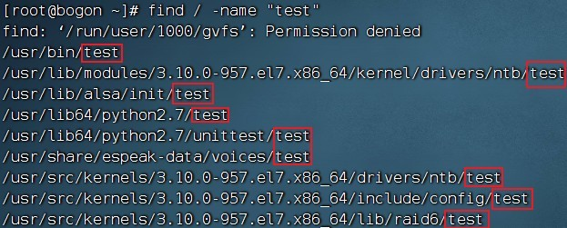

## find 命令 - 通配符

根据语法：`find 起始路径 -name "被查找文件名"`

被查找文件名，支持使用通配符 \* 来做模糊查询。

符号\* 表示通配符，即匹配任意内容（包含空），示例：

-   test\* ，表示匹配任何以 test 开头的内容

-   \*test ，表示匹配任何以 test 结尾的内容

-   \*test\* ，表示匹配任何包含 test 的内容

基于通配符的含义，可以结合 find 命令做文件的模糊查询。

-   查找所有以 test 开头的文件： find / -name "test\*"

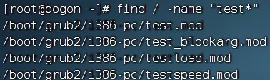

-   查找所有以 test 结尾的文件： find / -name "\*test"

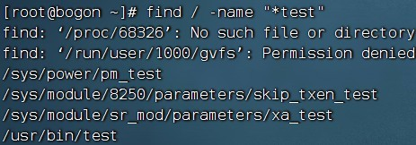

-   查找所有包含 test 的文件： find / -name "\*test\*"

## find 命令 - 按文件大小查找文件

语法：`find 起始路径 -size +|-n[kMG]`

+ +、- 表示大于和小于

-   n 表示大小数字

-   kMG 表示大小单位， k( 小写字母 ) 表示kb ， M 表示 MB ， G 表示 GB

示例：

-   查找小于 10KB 的文件： find / -size -10k

-   查找大于 100MB 的文件： find / -size +100M

-   查找大于 1GB 的文件： find / -size +1G

## 总结

1.  which 命令

-   查找命令的程序文件
-   语法：``find 起始路径 -name "被查找文件名"`
-   无需选项，只需要参数表示查找哪个命令

2. find 命令

-   用于查找指定的文件
-   按文件名查找：`find 起始路径 -name "被查找文件名"`
    -   支持通配符
-   按文件大小查找：`find 起始路径 -size +|-n[kMG]`

# 九、grep、wc和管道符

## grep 命令

可以通过 grep 命令，从文件中通过关键字过滤文件行。

语法：`grep [-n] 关键字 文件路径`

-   选项 -n ，可选，表示在结果中显示匹配的行的行号。

-   参数，关键字，必填，表示过滤的关键字，带有空格或其它特殊符号，建议使用 " " 将关键字包围起来

-   参数，文件路径，必填，表示要过滤内容的文件路径，可作为内容输入端口

现在，通过 touch 命令在 HOME 目录创建 itheima.txt，并通过图形化页面编辑并保存如下内容：

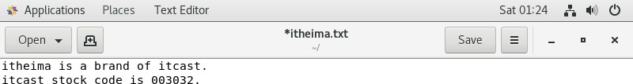

演示：

-   过滤itheima 关键字

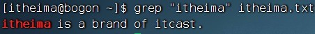

-   过滤itcast 关键字

* 过滤 code 关键字并显示行号

## wc 命令做数量统计

可以通过 wc 命令统计文件的行数、单词数量等

语法：`wc [-c -m -l -w] 文件路径`

-   选项， -c ，统计bytes 数量

-   选项， -m ，统计字符数量

-   选项， -l ，统计行数

-   选项， -w ，统计单词数量

-   参数，文件路径，被统计的文件，可作为内容输入端口

演示：

-   不带选项，统计文件

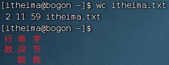

* 统计字节数

-   统计字符数

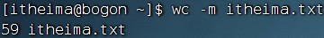

-   统计行数

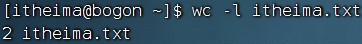

* 统计单词数

## 管道符

学习了 grep 命令后，我们再来学习一个新的特殊符号，管道符：\|

管道符的含义是：将管道符左边命令的结果，作为右边命令的输入

如上图：

-   cat itheima.txt 的输出结果（文件内容）

-   作为右边 grep 命令的输入（被过滤文件）

管道符的应用非常多

-   ls \| grep Desktop ，过滤 ls 的结果

-   find / -name "test" \| grep "/usr/lib64" ，过滤结果，只找路径带有 /usr/lib64 的结果

-   cat itheima.txt \| grep itcast \| grep itheima ，可以嵌套使用哦
    -   cat itheima.txt 的结果给 grep itcast 使用

    -   cat itheima.txt \| grep itcast 的结果给 grep itheima 使用

## 总结

1.  grep 命令

    -   从文件中通过关键字过滤文件行
        
    -   语法：`grep [-n] 关键字 文件路径`

    -   选项 -n ，可选，表示在结果中显示匹配的行的行号。

    -   参数，关键字，必填，表示过滤的关键字，建议使用""将关键字包围起来

    -   参数，文件路径，必填，表示要过滤内容的文件路径，可作为管道符的输入

2.  wc 命令
    * 命令统计文件的行数、单词数量、字节数、字符数等
    * 语法：`wc [-c -m -l -w] 文件路径`
    * 不带选项默认统计：行数、单词数、字节数
    * -c 字节数、 -m 字符数、 -l 行数、 -w 单词数
    * 参数，被统计的文件路径，可作为管道符的输入

3.  管道符 \|

    -   将管道符左边命令的结果，作为右边命令的输入

课后练习：对创建的 test.txt 进行统计

请使用 cat 、 grep 、管道符、 wc 命令组合，进行统计：

-   统计文件中带有 itcast 关键字的有几行
    -   cat test.txt \| grep itcast \| wc -l

-   统计文件中带有 itheima 关键字的结果中有多少个单词
    -   cat test.txt \| grep itheima \| wc -w

# 十、echo、tail和重定向符

## echo 命令

可以使用 echo 命令在命令行内输出指定内容

语法：`echo 输出的内容`

-   无需选项，只有一个参数，表示要输出的内容，复杂内容可以用""包围

演示：

-   在终端上显示： Hello Linux

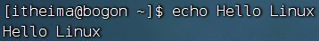

-   带有空格或\\ 等特殊符号，建议使用双引号包围
    -   因为不包围的话，空格后很容易被识别为参数 2 ，尽管echo 不受影响，但是要养成习惯哦

## 反引号 \`

看一下如下命令： echo pwd

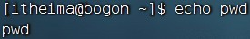

本意是想，输出当前的工作路径，但是 pwd 被作为普通字符输出了。

我们可以通过将命令用反引号（通常也称之为飘号)\` 将其包围

被\` 包围的内容，会被作为命令执行，而非普通字符

## 重定向符

我们再来学习两个特殊符号，重定向符： \> 和 \>\>

-   \> ，将左侧命令的结果，覆盖写入到符号右侧指定的文件中

-   \>\> ，将左侧命令的结果，追加写入到符号右侧指定的文件中

演示：

-   echo "Hello Linux" \> itheima.txt

* echo "Hello itheima" \> itheima.txt ，再次执行，覆盖新内容

-   echo "Hello itcast" \>\> itheima.txt ，再次执行，使用 \>\> 追加新内容

## tail 命令

使用 tail 命令，可以查看文件尾部内容，跟踪文件的最新更改，语法如下：

`tail [-f -num] Linux路径`

-   参数 Linux 路径，表示被跟踪的文件路径

-   选项 -f ，表示持续跟踪

-   选项 -num ，表示查看尾部多少行，不填默认 10 行

演示：

* 查看 /var/log/vmware-network.log 文件的尾部 10 行： tail /var/log/vmware-network.log

-   查看 /var/log/vmware-network.log 文件的尾部 3 行： tail -3 /var/log/vmware-network.log

> 使用 -f 选项，可以持续跟踪文件更改

* 复制一个新的 FinalShell 的标签

-   在第一个标签中，执行： touch test.txt ，创建一个 test.txt 文件

-   在第一个标签中，执行： tail -f test.txt ，持续跟踪文件更改

-   在第二个标签中，多次执行： echo "内容" \>\> test.txt，向文件追加内容

-   观察第一个标签的变化

## 总结

1.  echo 命令

-   可以使用 echo 命令在命令行内输出指定内容

-   语法：`echo 输出的内容`

-   无需选项，只有一个参数，表示要输出的内容，复杂内容可以用 " " 包围

2.  \` 反引号符

-   被\` 包围的内容，会被作为命令执行，而非普通字符

3. 重定向符

-   \> ，将左侧命令的结果，覆盖写入到符号右侧指定的文件中

-   \>\> ，将左侧命令的结果，追加写入到符号右侧指定的文件中

4. tail 命令

-   查看文件尾部内容，并可以持续跟踪

-   语法：`tail [-f -num] Linux路径`
    
-   -f ：持续跟踪， -num ：启动的时候查看尾部多少行，默认 10

-   Linux 路径，表示被查看的文件

课后练习

-   请使用 echo 并配合反引号，输出内容：我当前的工作目录是： \`具体的工作目录路径 \`
    
-   并结合重定向符，将输出结果覆盖写入 work.txt 文件 
    -   echo \"我当前的工作目录是： \`pwd\`\"  \>  work.txt

-   请使用 echo 输出任意内容并追加到 work.txt 文件中

-   通过tail 命令持续跟踪文件内容更改
    -   echo \" 内容 \" \>\> work.txt
    -   tail -f work.txt

# 十一、vi编辑器

## vi\\vim 编辑器介绍

vi\\vim 是visual interface 的简称, 是 Linux 中最经典的文本编辑器

同图形化界面中的 文本编辑器一样， vi 是命令行下对文本文件进行编辑的绝佳选择。

vim 是 vi 的加强版本，兼容 vi 的所有指令，不仅能编辑文本，而且还具有 shell 程序编辑的功能，可以不同颜色的字体来辨别语法的正确性，极大方便了程序的设计和编辑性。

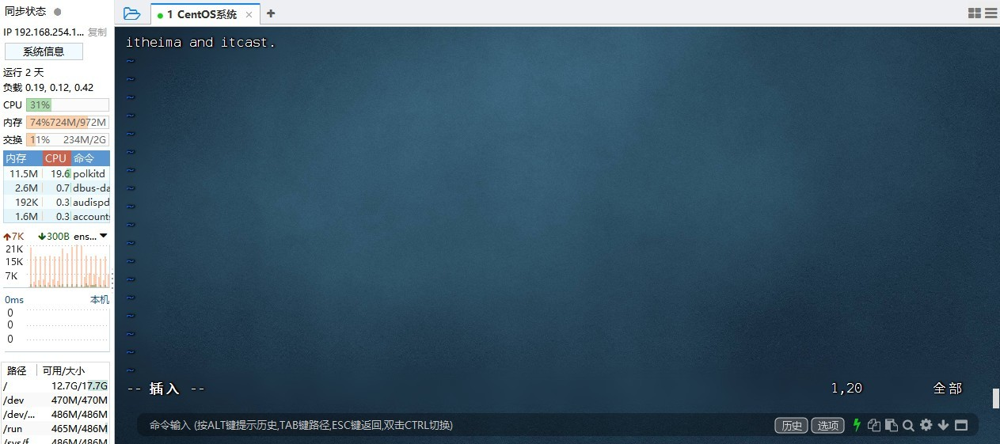

## vi\\vim 编辑器的三种工作模式

1. 命令模式（ Command mode ）

命令模式下，所敲的按键编辑器都理解为命令，以命令驱动执行不同的功能。此模型下，不能自由进行文本编辑。

2. 输入模式（ Insert mode )

也就是所谓的编辑模式、插入模式。此模式下，可以对文件内容进行自由编辑。

3. 底线命令模式（ Last line mode ）

以：开始，通常用于文件的保存、退出。

## 命令模式

如果需要通过 vi/vim编辑器编辑文件，请通过如下命令：

`vi 文件路径`

`vim 文件路径`

-   如果文件路径表示的文件不存在，那么此命令会用于编辑新文件

-   如果文件路径表示的文件存在，那么此命令用于编辑已有文件

vim 兼容全部的vi 功能，后续全部使用 vim 命令

## vi 编辑器的快速体验

通过 vi/vim 命令编辑文件，会打开一个新的窗口，此时这个窗口就是：命令模式窗口

命令模式是 vi 编辑器的入口和出口，如图

-   进入vi 编辑器会进入命令模式

-   通过命令模式输入键盘指令，可以进入输入模式

-   输入模式需要退回到命令模式，然后通过命令可以进入底线命令模式

快速体验：

1.  使用： vim hello.txt ，编辑一个新文件，执行后进入的是命令模式

2.  在命令模式内，按键盘 i ，进入输入模式

3.  在输入模式内输入： itheima and itcast.

4.  输入完成后，按 esc 回退到命令模式

5.  在命令模式内，按键盘 : ，进入底线命令模式

6.  在底线命令内输入： wq ，保存文件并退出 vi 编辑器

## 命令模式快捷键

从命令模式进入输入模式的一些常见快捷键：

关于光标的一些快捷键：

其他一些快捷键：

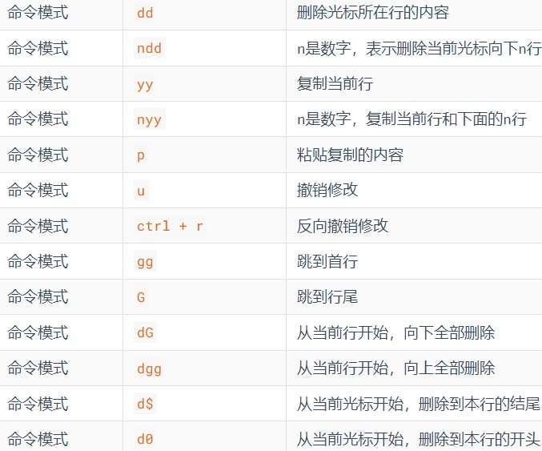

## 底线命令模式

编辑模式没有什么特殊的，进入编辑模式后，任何快捷键都没有作用，就是正常输入文本而已。

唯一大家需要记住的，就是：通过 esc ，可以退回到命令模式中即可。

在命令模式内，输入 : ，即可进入底线命令模式，支持如下命令：

## 补充：关于命令选项的说明

### 命令的选项

我们学习的一系列 Linux 命令，它们所拥有的选项都是非常多的。

比如，简单的 ls 命令就有：

-a -A -b -c -C -d -D -f -F -g -G -h -H -i -I -k -l -L -m -n -N -o -p -q -Q -r-R -s -S -t -T -u -U -v -w -x -X -1

等选项，可以发现选项是极其多的。

学习时并不会将全部的选项都进行学习，只会对常见的选项进行学习，足够满足绝大多数的学习、工作场景。

### 查看命令帮助和手册

如果想要对命令的其它选项进行查阅，可以通过如下方式：

-   任何命令都支持： \--help 选项，可以通过这个选项，查看命令的帮助。

如： ls \--help ， 会列出 ls 命令的帮助文档

帮助文档会简单的对命令的使用方式进行说明

如果想要查看命令的详细手册，可以通过 man （ manual ，手册）命令查看

比如：

-   man ls ，就是查看 ls 命令的详细手册

-   man cd ，就是查看 cd 命令的详细手册

-   大多数手册都是全英文的，如果阅读吃力，可以通过重定向符： man ls \> ls-man.txt ，输出手册到文件，然后通过翻译软件翻译内容查看

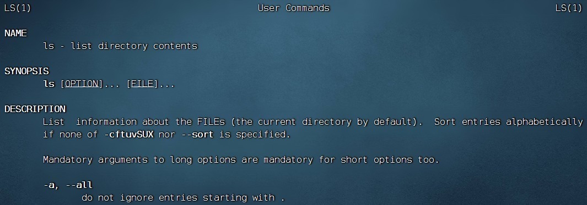

## 总结

1.  什么是 vi/vim 编辑器

-   vi\\vim 编辑器，就是命令行模式下的文本编辑器，用来编辑文件

-   vim 是vi 的升级版，一般用vim 即可，包含全部 vi 功能

2. 基础命令

* `vi 文件路径`
* `vim 文件路径`

3. 运行模式

-   命令模式，默认的模式，可以通过键盘快捷键控制文件内容

-   输入模式，通过命令模式进入，可以输入内容进行编辑，按 esc 退回命令模式

-   底线命令模式，通过命令模式进入，可以对文件进行保存、关闭等操作

4. 命令的选项非常多， 仅学习常见的，满足绝大多数使用场景。如需详细的命令说明， 可以：

-   查看命令帮助， 通过 \--help 选项

-   查看命令手册， 通过man 命令
