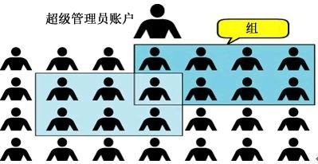
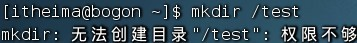
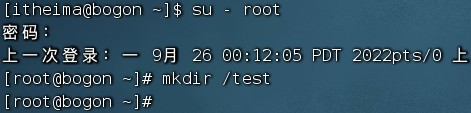
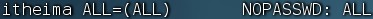
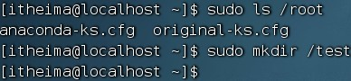

# 一、认知root用户

## root 用户（超级管理员）

无论是 Windows 、 MacOS 、 Linux 均采用多用户的管理模式进行权限管理。

-   在 Linux 系统中，拥有最大权限的账户名为：root（超级管理员）

-   而在前期，我们一直使用的账户是普通的用户：itheima



root 用户拥有最大的系统操作权限，而普通用户在许多地方的权限是受限的。

演示：

-   使用普通用户在根目录下创建文件夹



-   切换到 root 用户后，继续尝试




普通用户的权限，一般在其 HOME 目录内是不受限的

一旦出了 HOME 目录，大多数地方，普通用户仅有只读和执行权限，无修改权限

## su 和 exit 命令

在前面，我们接触过 su 命令切换到 root 账户。

su 命令就是用于账户切换的系统命令，其来源英文单词： Switch User

语法：`su [-] [用户名]`

-   \- 符号是可选的，表示是否在切换用户后加载环境变量（后续讲解），建议带上
    
-   参数：用户名，表示要切换的用户，用户名也可以省略，省略表示切换到 root
    
-   切换用户后，可以通过 exit 命令退回上一个用户，也可以使用快捷键：ctrl + d
    
-   使用普通用户，切换到其它用户需要输入密码，如切换到 root 用户

-   使用 root 用户切换到其它用户，无需密码，可以直接切换

## sudo 命令

在我们得知 root 密码的时候，可以通过 su 命令切换到 root 得到最大权限。但是我们不建议长期使用 root 用户，避免带来系统损坏。

我们可以使用 sudo 命令，为普通的命令授权，临时以 root 身份执行。

语法：`sudo 其他命令`

-   在其它命令之前，带上 sudo ，即可为这一条命令临时赋予 root 授权

-   但是并不是所有的用户，都有权利使用 sudo ，我们需要为普通用户配置 sudo 认证

## 为普通用户配置 sudo 认证

-   切换到 root 用户，执行 visudo 命令，会自动通过 vi 编辑器打开：/etc/sudoers
    
- 在文件的最后添加：

  

  * 其中最后的 NOPASSWD:ALL 表示使用 sudo 命令，无需输入密码

-   最后通过 wq 保存

- 切换回普通用户

  

* 执行的命令，均以 root 运行

## 总结

1.  Linux 系统的超级管理员用户是：root 用户
2.  su 命令

* 可以切换用户，语法：`su [-] [用户名]`

-   \- 表示切换后加载环境变量，建议带上
-   用户可以省略，省略默认切换到 root

3.  sudo 命令

-   可以让一条普通命令带有 root 权限，语法：`sudo 其他命令`

-   需要以 root 用户执行 visudo 命令，增加配置方可让普通用户有 sud o 命令的执行权限

# 二、用户、用户组管理

# 三、查看权限控制

# 四、修改权限控制-chmod

# 五、修改权限控制-chown


## Learning Objectives

1.  理解用户、用户组的概念

2.  掌握用户、用户组管理的相关命令

### 用户、用户组

> Linux 系统中可以：

-   配置多个用户

-   配置多个用户组

-   用户可以加入多个用户组中

> Linux 中关于权限的管控级别有 2 个级别，分别是：

-   针对用户的权限控制

-   针对用户组的权限控制

> 比如，针对某文件，可以控制用户的权限，也可以控制用户组的权限。
>
> 所以，我们需要学习在 Linux
> 中进行用户、用户组管理的基础命令，为后面学习权限控制打下基础。

### 用户组管理

> 以下命令需 root 用户执行

-   创建用户组

> groupadd 用户组名

-   删除用户组 groupdel 用户组名

> 为后续演示，我们创建一个 itcast 用户组：
> groupadd itcast

### 用户管理

> 以下命令需 root 用户执行

-   创建用户

> useradd \[-g -d\] 用户名

-   选项： -g 指定用户的组，不指定 -g ，会创建同名组并自动加入，指定 -g
    > 需要组已经存在，如已存在同名组，必须使用 -g

-   选项： -d 指定用户 HOME 路径，不指定， HOME 目录默认在： /home/
    > 用户名

```{=html}
<!-- -->
```
-   删除用户 userdel \[-r\] 用户名

    -   选项： -r ，删除用户的 HOME 目录，不使用 -r ，删除用户时， HOME
        > 目录保留

-   查看用户所属组 id \[ 用户名 \]

    -   参数：用户名，被查看的用户，如果不提供则查看自身

-   修改用户所属组

> usermod -aG 用户组
> 用户名，将指定用户加入指定用户组


### getent

> 使用getent 命令，可以查看当前系统中有哪些用户语法： getent passwd
>
> {width="5.33917104111986in"
> height="0.21875in"}{width="4.666666666666667in"
> height="1.8847211286089238in"} :HOME 目录: 执行终端 ( 默认 bash)
>
> 后面学习

### getent

> {width="3.75in"
> height="2.1805555555555554in"}使用getent
> 命令，同样可以查看当前系统中有哪些用户组语法： getent group
>
> 包含 3 份信息，组名称 : 组认证 ( 显示为x): 组ID

高级软件人才培训专家

1.  Linux 用户管理模式

-   Linux 可以支持多用户、多用户组、用户加入多个组

-   Linux 权限管控的单元是用户级别和用户组级别

2.  用户、用户组相关管理命令

-   groupadd 添加组、 groupdel 删除组

-   useradd 添加用户、 userdel 删除用户

-   usermod 修改用户组、 id 命令查看用户信息

-   getent passwd 查看系统全部用户信息

-   getent group 查看系统全部组信息

高级软件人才培训专家

## Learning Objectives

1.  掌握查看 Linux 文件的权限管控信息

2.  掌握读、写、执行三种权限的含义

### 认知权限信息

> 通过ls -l 可以以列表形式查看内容，并显示权限细节

{width="5.899854549431321in"
height="2.5678116797900263in"}

-   序号 1 ，表示文件、文件夹的权限控制信息

-   序号 2 ，表示文件、文件夹所属用户

-   序号 3 ，表示文件、文件夹所属用户组

### 认知权限信息

> {width="3.122221128608924in"
> height="2.591666666666667in"}让我们来解析一下序号 1 ，权限细节
>
> 权限细节总共分为 10 个槽位

{width="8.41799321959755in"
height="2.2465616797900263in"}

> 举例： drwxr-xr-x ，表示：

-   这是一个文件夹，首字母 d 表示

-   所属用户 ( 右上角图序号 2) 的权限是：有 r 有w 有x ， rwx

-   所属用户组 ( 右上角图序号 3) 的权限是：有 r 无w 有x ， r-x （ -
    表示无此权限）

-   其它用户的权限是：有 r 无w 有x ， r-x

### rwx

> 那么， rwx 到底代表什么呢？

-   r 表示读权限

-   w 表示写权限

-   x 表示执行权限

> 针对文件、文件夹的不同， rwx 的含义有细微差别

-   r ，针对文件可以查看文件内容

    -   针对文件夹，可以查看文件夹内容，如 ls 命令

-   w ，针对文件表示可以修改此文件

    -   针对文件夹，可以在文件夹内：创建、删除、改名等操作

-   x ，针对文件表示可以将文件作为程序执行

    -   针对文件夹，表示可以更改工作目录到此文件夹，即 cd 进入

### {width="4.213887795275591in" height="0.9694444444444444in"}案例

> 当前用户 itheima ，非文件所属用户和用户组，锁定最后三位权限为： \-\--
> ，无读取权限

{width="5.176388888888889in"
height="0.20833333333333334in"}{width="3.243917322834646in"
height="0.4479166666666667in"}{width="3.4263877952755903in"
height="0.4583333333333333in"}


> 1.
>
> {width="5.088888888888889in"
> height="1.358332239720035in"}2. 权限细节如何解读 3.

## Learning Objectives

1.  掌握使用 chmod 修改权限信息

2.  掌握使用数字序号标记权限

### chmod 命令

> 我们可以使用 chmod 命令，修改文件、文件夹的权限信息。
>
> {width="2.5722222222222224in"
> height="0.2708333333333333in"}注意，只有文件、文件夹的所属用户或 root
> 用户可以修改。语法：

-   选项： -R ，对文件夹内的全部内容应用同样的操作

> 示例：

-   chmod u=rwx,g=rx,o=x hello.txt ，将文件权限修改为： rwxr-x\--x

    -   其中： u 表示 user 所属用户权限， g 表示 group 组权限， o 表示
        > other 其它用户权限

-   chmod -R u=rwx,g=rx,o=x test
    ，将文件夹 test 以及文件夹内全部内容权限设置为： rwxr-x\--x

> 除此之外，还有快捷写法： chmod 751 hello.txt
>
> 将hello.txt 的权限修改为 751
>
> 那么问题来了， 751 表示什么意思呢？

### 权限的数字序号

> 权限可以用 3
> 位数字来代表，第一位数字表示用户权限，第二位表示用户组权限，第三位表示其它用户权限。数字的细节如下：
> r 记为 4 ， w 记为 2 ， x 记为 1 ，可以有：

-   0 ：无任何权限， 即 \-\--

-   1 ：仅有 x 权限， 即 \--x

-   2 ：仅有 w 权限 即 -w-

-   3 ：有 w 和x 权限 即 -wx

-   4 ：仅有 r 权限即 r\--

-   5 ：有 r 和x 权限 即 r-x

-   6 ：有 r 和w 权限 即 rw-

-   7 ：有全部权限 即 rwx

> 所以 751 表示： rwx(7) r-x(5) \--x(1)

高级软件人才培训专家

### 案例

-   将hello.txt 的权限修改为： r-x\--xr-x ，数字序号为： chmod 515
    hello.txt

-   将hello.txt 的权限修改为： -wx-w-rw- ，数字序号为： chmod 326
    hello.txt

-   序号 123 代表的权限是：

> \--x-w\--wx

高级软件人才培训专家

1.  chmod 命令

-   功能，修改文件、文件夹的权限细节

-   {width="2.5722222222222224in"
    > height="0.2708333333333333in"}限制，只能是文件、文件夹的所属用户或
    > root 有权修改

-   语法：

-   选项： -R ，对文件夹内的全部内容应用同样规则

2.  权限的数字序号

-   r 代表 4 ， w 代表 2 ， x 代表 1

-   rwx 的相互组合可以得到从 0 到 7 的 8 种权限组合

-   如 7 代表： rwx ， 5 代表： r-x ， 1 代表： \--x

高级软件人才培训专家

## Learning Objectives

> 1\. 掌握使用 chown 修改所属用户、用户组

### chown 命令

> 使用chown 命令，可以修改文件、文件夹的所属用户和用户组
>
> {width="3.5347222222222223in"
> height="1.5444444444444445in"}{width="3.863888888888889in"
> height="0.3847211286089239in"}普通用户无法修改所属为其它用户或组，所以此命令只适用于
> root 用户执行语法：

-   选项， -R ，同chmod ，对文件夹内全部内容应用相同规则

-   选项，用户，修改所属用户

-   选项，用户组，修改所属用户组

-   : 用于分隔用户和用户组

> 示例：

-   chown root hello.txt ，将hello.txt 所属用户修改为 root

-   chown :root hello.txt ，将hello.txt 所属用户组修改为 root

-   chown root:itheima hello.txt ，将hello.txt 所属用户修改为 root
    ，用户组修改为 itheima

-   chown -R root test ，将文件夹 test 的所属用户修改为 root
    并对文件夹内全部内容应用同样规则

高级软件人才培训专家

> chown 命令

-   功能，修改文件、文件夹的所属用户、组

-   {width="3.863888888888889in"
    > height="0.38472222222222224in"}限制，只可 root 执行

-   语法：

-   选项， -R ，同 chmod ，对文件夹内全部内容应用相同规则

-   选项，用户，修改所属用户

-   选项，用户组，修改所属用户组

-   : 用于分隔用户和用户组
