# 一、各类小技巧（快捷键）

## ctrl + c 强制停止

-   Linux 某些程序的运行，如果想要强制停止它，可以使用快捷键 ctrl + c


-   命令输入错误，也可以通过快捷键 ctrl + c ，退出当前输入，重新输入


## ctrl + d 退出或登出

-   可以通过快捷键： ctrl + d，退出账户的登录


-   或者退出某些特定程序的专属页面

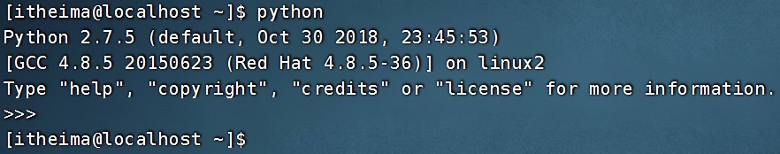

> ps：不能用于退出 vi/vim

## 历史命令搜索

-   可以通过 history 命令，查看历史输入过的命令


-   可以通过： ! 命令前缀，自动执行上一次匹配前缀的命令


-   可以通过快捷键： ctrl + r ，输入内容去匹配历史命令


如果搜索到的内容是你需要的，那么：

-   回车键可以直接执行

-   键盘左右键，可以得到此命令（不执行）

## 光标移动快捷键

-   ctrl + a ，跳到命令开头

-   ctrl + e ，跳到命令结尾

-   ctrl + 键盘左键，向左跳一个单词

-   ctrl + 键盘右键，向右跳一个单词

## 清屏

-   通过快捷键 ctrl + l ，可以清空终端内容

-   或通过命令 clear 得到同样效果

## 总结

1.  ctrl + c 强制停止

2.  ctrl + d 退出登出

3.  history 查看历史命令

4.  ! 命令前缀，自动匹配上一个命令

5.  ctrl + r，搜索历史命令

6.  ctrl + a \| e ，光标移动到命令开始或结束

7.  ctrl + ← \| → ，左右跳单词

8.  ctrl + l 或 clear 命令 清屏

# 二、软件安装

## Linux 系统的应用商店

操作系统安装软件有许多种方式，一般分为：

-   下载安装包自行安装

    -   如 win 系统使用 exe 文件、 msi 文件等

    -   如 mac 系统使用 dmg 文件、 pkg 文件等

-   系统的应用商店内安装

    -   如win 系统有 Microsoft Store 商店

    -   如mac 系统有 AppStore 商店

Linux 系统同样支持这两种方式，我们首先学习使用： Linux 命令行内的"应用商店"， yum 命令安装软件

## yum 命令

yum ： RPM 包软件管理器，用于自动化安装配置 Linux 软件，并可以自动解决依赖问题。

语法：`yum [-y] [install | remove |search] 软件名称`

-   选项： -y ，自动确认，无需手动确认安装或卸载过程

-   install ：安装

-   remove ：卸载

-   search ：搜索

> yum 命令需要 root 权限哦，可以 su 切换到 root ，或使用 sudo 提权。
>
> yum 命令需要联网

-   yum \[-y\] install wget ， 通过 yum 命令安装 wget 程序


-   yum \[-y\] remove wget ，通过 yum 命令卸载 wget 命令

-   yum search wget ，通过 yum 命令，搜索是否有 wget 安装包

## apt 命令 - 扩展

前面学习的各类 Linux 命令，都是通用的。 但是软件安装， CentOS 系统和 Ubuntu 是使用不同的包管理器。 

CentOS 使用 yum 管理器， Ubuntu 使用 apt 管理器

通过前面学习的 WSL 环境，我们可以得到 Ubuntu 运行环境。

语法：`apt [-y] [install | remove |search] 软件名称`

用法和 yum 一致，同样需要 root 权限

-   apt install wget ，安装 wget

-   apt remove wget ，移除 wget

-   apt search wget ，搜索 wget


## 总结

1.  在CentOS 系统中，使用 yum 命令联网管理软件安装
    * yum 语法：`yum [-y] [install | remove |search] 软件名称`

2.  在 Ubuntu 系统中，使用 apt 命令联网管理软件安装
    * apt 语法：`apt [-y] [install | remove |search] 软件名称`


# 三、systemctl

## systemctl 命令

Linux 系统很多软件（内置或第三方）均支持使用 systemctl 命令控制：启动、停止、开机自启

能够被 systemctl 管理的软件，一般也称之为：服务

语法：`systemctl start | stop | status | enable | disable 服务名`

-   start 启动

-   stop 关闭

-   status 查看状态

-   enable 开启开机自启

-   disable 关闭开机自启

系统内置的服务比较多，比如：

-   NetworkManager ，主网络服务

-   network ，副网络服务

-   firewalld ，防火墙服务

-   sshd ， ssh 服务（ FinalShell 远程登录 Linux 使用的就是这个服务）

现在可以使用 systemctl 去尝试一下，控制这些服务的启动、关闭、自启动啦

除了内置的服务以外，部分第三方软件安装后也可以以 systemctl 进行控制。

-   yum install -y ntp ，安装 ntp 软件

可以通过 ntpd 服务名，配合 systemctl 进行控制

-   yum install -y httpd ，安装 apache 服务器软件

可以通过 httpd 服务名，配合 systemctl 进行控制

> 部分软件安装后没有自动集成到 systemctl 中，我们可以手动添加。这部分内容在后续章节和大家详细讲解。

## 总结

1. systemctl 命令的作用是？

可以控制软件（服务）的启动、关闭、开机自启动

-   系统内置服务均可被 systemctl 控制

-   第三方软件，如果自动注册了可以被 systemctl 控制

-   第三方软件，如果没有自动注册，可以手动注册（后续学习）

2. 语法

`systemctl start | stop | status | enable | disable 服务名`

# 四、软连接

## ln 命令创建软连接

在系统中创建软链接，可以将文件、文件夹链接到其它位置。

类似Windows 系统中的《快捷方式》

语法：`ln -s 参数1 参数2`

-   -s 选项，创建软连接

-   参数 1 ：被链接的文件或文件夹

-   参数 2 ：要链接去的目的地


实例：

- ```
  ln -s /etc/yum.conf ~/yum.conf
  ```

- ```
  ln -s /etc/yum ~/yum
  ```


## 总结

1. 什么是软连接？

可以将文件、文件夹链接到其他位置

链接只是一个指向，并不是物理移动，类似 Windows 系统的快捷方式

2. 软连接的使用语法

`ln -s 参数1 参数2`

-   -s 选项，创建软连接

-   参数 1 ：被链接的文件或文件夹

-   参数 2 ：要链接去的目的地

# 五、日期、时区

## date 命令

通过date 命令可以在命令行中查看系统的时间

语法：`date [-d] [+格式化字符串]`

-   -d 按照给定的字符串显示日期，一般用于日期计算

-   格式化字符串：通过特定的字符串标记，来控制显示的日期格式

    -   %Y：年

    -   %y：年份后两位数字 (00..99)

    -   %m：月份 (01..12)

    -   %d：日 (01..31)

    -   %H：小时 (00..23)

    -   %M：分钟 (00..59)

    -   %S：秒 (00..60)

    -   %s：自 1970-01-01 00:00:00 UTC 到现在的秒数

演示：

-   使用date 命令本体，无选项，直接查看时间


可以看到这个格式非常的不习惯。我们可以通过格式化字符串自定义显示格式

-   按照 2022-01-01 的格式显示日期


* 按照 2022-01-01 10:00:00 的格式显示日期


如上，由于中间带有空格，所以使用双引号包围格式化字符串，作为整体。

## date 命令进行日期加减

-d 选项，可以按照给定的字符串显示日期，一般用于日期计算


其中支持的时间标记为：

-   year：年

-   month：月

-   day：天

-   hour：小时

-   minute：分钟

-   second：秒

> -d 选项可以和格式化字符串配合一起使用

## 修改 Linux 时区

细心的同学可能会发现，通过 date 查看的日期时间是不准确的，这是因为：系统默认时区非中国的东八区。

使用 root 权限，执行如下命令，修改时区为东八区时区

```sh
rm -f /etc/localtime
sudo ln -s /user/share/zoneinfo/Asia/Shanghai /etc/localtime
```

将系统自带的 localtime 文件删除，并将 /usr/share/zoneinfo/Asia/Shanghai 文件链接为 localtime 文件即可

## ntp 程序

我们可以通过 ntp 程序自动校准系统时间

安装ntp ： yum -y install ntp

启动并设置开机自启：

-   systemctl start ntpd

-   systemctl enable ntpd

当ntpd 启动后会定期的帮助我们联网校准系统的时间

-   也可以手动校准（需 root 权限）： ntpdate -u ntp.aliyun.com

通过阿里云提供的服务网址配合 ntpdate（安装 ntp 后会附带这个命令）命令自动校准。


## 总结

1. date 命令的作用和用法

date 命令可以查看日期时间，并可以格式化显示形式以及做日期计算

语法：`date [-d] [+格式化字符串]`

-   %Y：年

-   %y：年份后两位数字 (00..99)

-   %m：月份 (01..12)

-   %d：日 (01..31)

-   %H：小时 (00..23)

-   %M：分钟 (00..59)

-   %S：秒 (00..60)

-   %s：自 1970-01-01 00:00:00 UTC 到现在的秒数

2. 如何修改 Linux 时区

```sh
rm -f /etc/localtime
sudo ln -s /user/share/zoneinfo/Asia/Shanghai /etc/localtime
```

3. ntp 的作用

可以自动联网同步时间，也可以通过`ntpdate -u ntp.aliyun.com`手动校准时间

# 六、IP地址、主机名

## 1、IP 和主机名

### IP 地址

每一台联网的电脑都会有一个地址，用于和其它计算机进行通讯

IP 地址主要有 2 个版本， V4 版本和 V6 版本（ V6 很少用，课程暂不涉及）

IPv4 版本的地址格式是： a.b.c.d ，其中abcd 表示 0\~255 的数字，如 192.168.88.101 就是一个标准的 IP 地址

可以通过命令：`ifconfig` ，查看本机的 ip 地址，如无法使用 ifconfig 命令，可以安装： yum -y install net-tools


### 特殊IP 地址

除了标准的IP 地址以外，还有几个特殊的 IP 地址需要我们了解：

-   127.0.0.1 ，这个 IP 地址用于指代本机


-   0.0.0.0 ，特殊 IP 地址

    -   可以用于指代本机

    -   可以在端口绑定中用来确定绑定关系（后续讲解）

    -   在一些IP 地址限制中，表示所有 IP 的意思，如放行规则设置为 0.0.0.0 ，表示允许任意 IP 访问

### 主机名

每一台电脑除了对外联络地址（ IP 地址）以外，也可以有一个名字，称之为主机名

无论是Windows 或 Linux 系统，都可以给系统设置主机名

-   Windows 系统主机名


* Linux 系统主机名


### 在 Linux 中修改主机名

-   可以使用命令： hostname 查看主机名


-   可以使用命令： hostnamectl set-hostname 主机名，修改主机名（需 root）


* 重新登录 FinalShell 即可看到主机名已经正确显示


### 域名解析

IP 地址实在是难以记忆，有没有什么办法可以通过主机名或替代的字符地址去代替数字化的 IP 地址呢？

实际上，我们一直都是通过字符化的地址去访问服务器，很少指定 IP 地址

比如，我们在浏览器内打开： [www.baidu.com](http://www.baidu.com/)，会打开百度的网址

其中， [www.baidu.com](http://www.baidu.com/) 是百度的网址，我们称之为：域名

不是说通过 IP 地址才能访问服务器吗？为什么域名这一串好记的字符，也可以呢？

这一切，都是域名解析帮助我们解决的。

访问[www.baidu.com](http://www.baidu.com/) 的流程如下：


即：

-   先查看本机的记录（私人地址本)
    
    -   Windows 看： C:\\Windows\\System32\\drivers\\etc\\hosts
    
    -   Linux 看： /etc/hosts
    
-   再联网去 DNS 服务器（如 114.114.114.114 ， 8.8.8.8 等）询问

### 配置主机名映射

比如，我们 FinalShell 是通过 IP 地址连接到的 Linux 服务器，那有没有可能通过域名（主机名）连接呢？

可以，我们只需要在 Windows 系统的： C:\\Windows\\System32\\drivers\\etc\\hosts 文件中配置记录即可


### 总结

1. 什么是 IP 地址，有什么作用？

IP 地址是联网计算机的网络地址，用于在网络中进行定位

格式是： a.b.c.d，其中abcd 是 0\~255 的数字

特殊IP 有： 127.0.0.1 ，本地回环 IP ，表示本机。

0.0.0.0 ：也可表示本机，也可以在一些白名单中表示任意 IP

2. 什么是主机名？

主机名就是主机的名称，用于标识一个计算机

3. 什么是域名解析（主机名映射）

可以通过主机名找到对应计算机的 IP 地址，这就是主机名映射（域名解析）

先通过系统本地的记录去查找，如果找不到就联网去公开 DNS 服务器去查找

## 2、虚拟机配置固定 IP

### 为什么需要固定 IP

当前我们虚拟机的 Linux 操作系统，其 IP 地址是通过 DHCP 服务获取的。

DHCP ：动态获取 IP 地址，即每次重启设备后都会获取一次，可能导致 IP 地址频繁变更

* 原因 1 ：办公电脑 IP 地址变化无所谓，但是我们要远程连接到 Linux 系统，如果 IP 地址经常变化我们就要频繁修改适配很麻烦

* 原因 2 ：在刚刚我们配置了虚拟机 IP 地址和主机名的映射，如果 IP 频繁更改，我们也需要频繁更新映射关系

综上所述，我们需要 IP 地址固定下来，不要变化了。

### 在VMware Workstation 中配置固定 IP

配置固定 IP 需要 2 个大步骤：

1.  在VMware Workstation （或 Fusion ）中配置 IP 地址网关和网段（ IP 地址的范围）

2.  在 Linux 系统中手动修改配置文件，固定 IP


首先让我们，先进行第一步，跟随图片进行操作

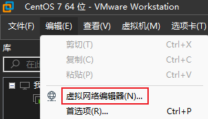


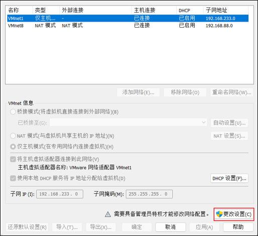


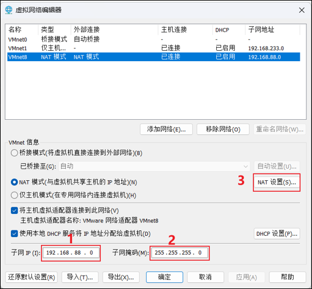


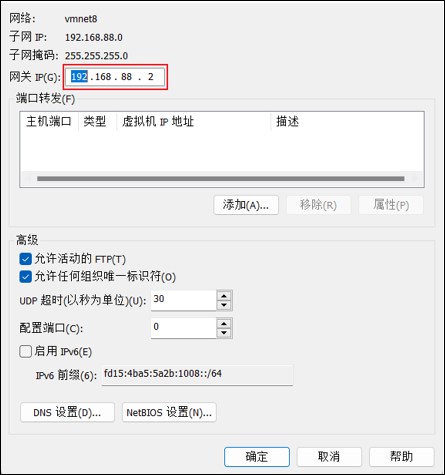

现在进行第二步，在Linux 系统中修改固定 IP

使用vim 编辑 /etc/sysconfig/network-scripts/ifcfg-ens33 文件，填入如下内容

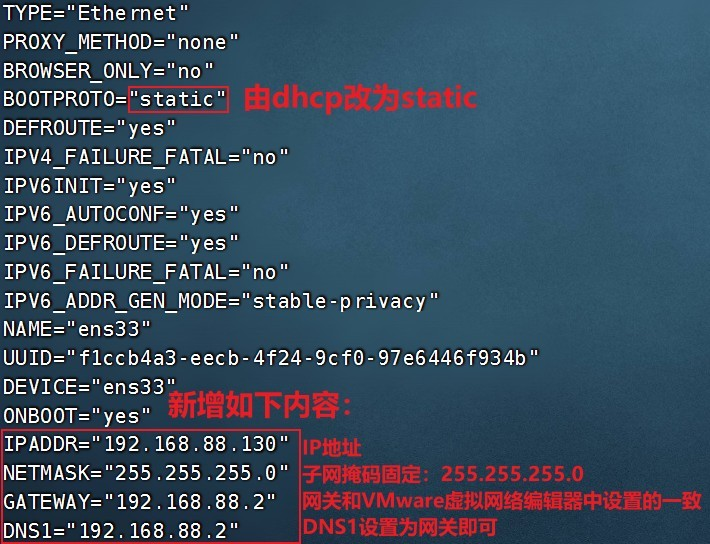

执行： systemctl restart network 重启网卡，执行 ifconfig 即可看到 ip 地址固定为 192.168.88.130 了

### 在 VMware Fusion 中配置固定 IP

#### 步骤一：先修改 VMware Fusion 的网络设置

1.  打开 Mac 系统的终端程序，并执行如下命令：


2.  在终端内执行： sudo su - ，并输入个人系统密码切换到 root 用户

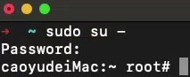

3.  先备份一下文件： 

```sh
cp /Library/Preferences/VMware\Fusion/networking 
/Library/Preferences/VMware\Fusion/networking.bakcup
```

通过vim 编辑器修改文件： 

```sh
vim /Library/Preferences/VMware\Fusion/networking
```

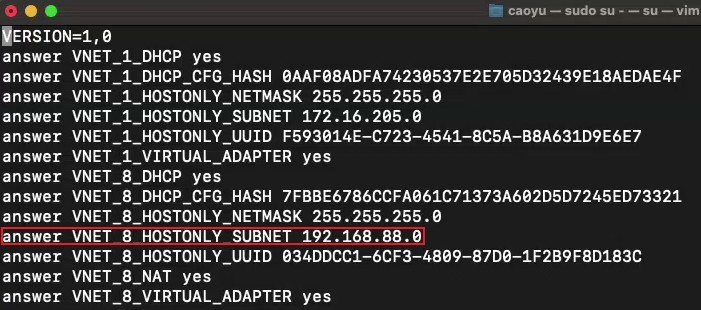

修改第 11 行为如图内容： 192.168.88.0，并保存退出

4.  备份文件： 

```sh
cp /Library/Preferences/VMware\Fusion/vmnet8/nat.conf
/Library/Preferences/VMware\Fusion/vmnet8/nat.conf.backup
```

修改文件： 

```sh
vim /Library/Preferences/VMware\Fusion/vmnet8/nat.conf
```

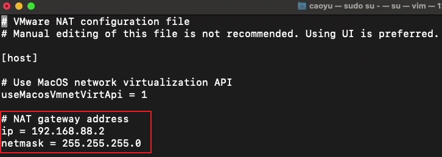

如图所示在 NAT gateway address 下修改 ip 为： 192.168.88.2（这是网关的 IP ），并保存退出

5.  启动VMware Fusion ，进入 Linux 虚拟机

#### 步骤 2 ：在 Linux 中修改固定 IP

-   在虚拟机的图形化页面中，打开终端，使用 su - 切换到 root 用户

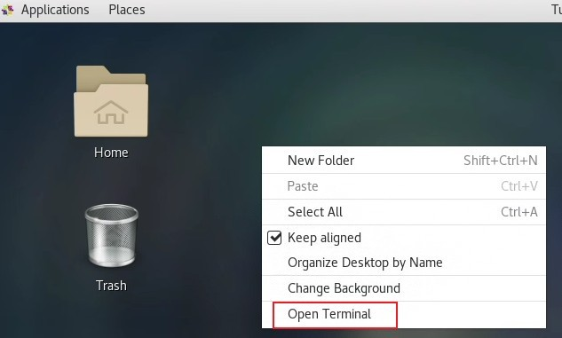

-   使用vim 编辑 /etc/sysconfig/network-scripts/ifcfg-ens33 文件，填入如下内容

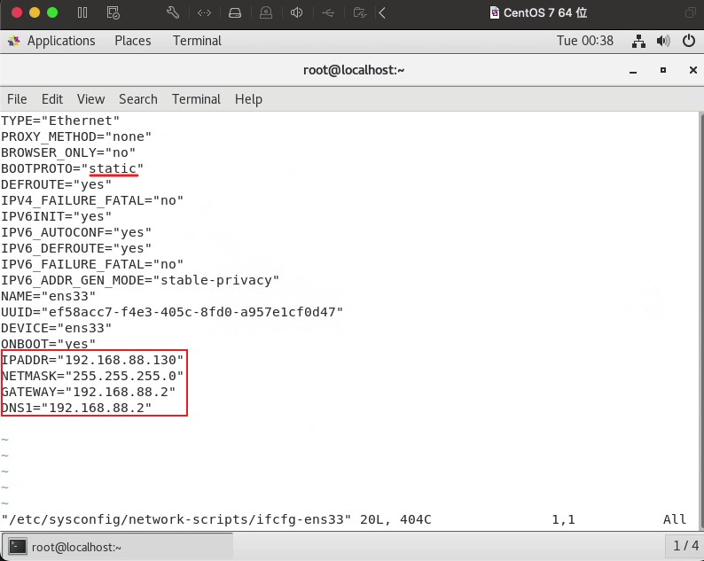

-   执行： systemctl restart network 重启网卡，执行 ifconfig 即可看到 ip 地址固定为 192.168.88.130 了

# 七、网络传输

## 1、下载和网络请求

### ping 命令

可以通过 ping 命令，检查指定的网络服务器是否是可联通状态

语法：`ping [-c num] ip或主机名`

-   选项： -c ，检查的次数，不使用 -c 选项，将无限次数持续检查

-   参数： ip 或主机名，被检查的服务器的 ip 地址或主机名地址

示例：

-   检查到 baidu.com 是否联通

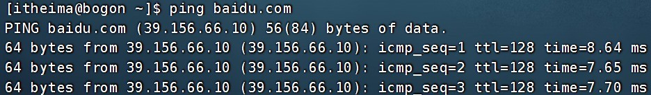

结果表示联通，延迟 8ms 左右

-   检查到 39.156.66.10 是否联通，并检查 3 次

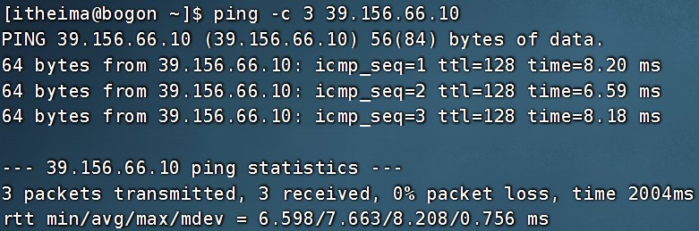

### wget 命令

wget 是非交互式的文件下载器，可以在命令行内下载网络文件

语法：`wget [-b] url`

-   选项： -b ，可选，后台下载，会将日志写入到当前工作目录的 wget-log 文件
    
-   参数： url ，下载链接

示例：

-   下载 apache-hadoop 3.3.0 版本： wget <http://archive.apache.org/dist/hadoop/common/hadoop-3.3.0/hadoop-3.3.0.tar.gz>

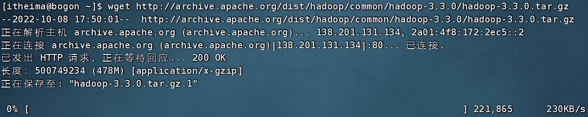

* 在后台下载： wget -b <http://archive.apache.org/dist/hadoop/common/hadoop-3.3.0/hadoop-3.3.0.tar.gz>

-   通过 tail 命令可以监控后台下载进度： tail -f wget-log

> 注意：无论下载是否完成，都会生成要下载的文件，如果下载未完成，请及时清理未完成的不可用文件。

### curl 命令

curl 可以发送 http 网络请求，可用于：下载文件、获取信息等

语法：`curl [-O] url`

-   选项： -O ，用于下载文件，当 url 是下载链接时，可以使用此选项保存文件
    
-   参数： url ，要发起请求的网络地址

示例：

-   向cip.cc 发起网络请求： curl cip.cc

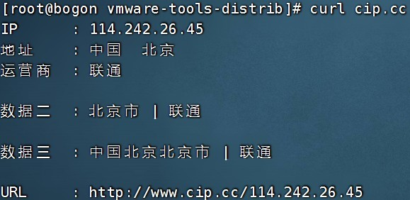

-   向python.itheima.com 发起网络请求： curl python.itheima.com

-   通过curl 下载 hadoop-3.3.0 安装包： curl -O <http://archive.apache.org/dist/hadoop/common/hadoop-3.3.0/hadoop-3.3.0.tar.gz>

### 总结

1. 使用 ping 命令可以测试到某服务器是否可联通

语法：`ping [-c num] ip或主机名`

选项： -c ，测试的次数

2. 使用 wget 命令可以进行网络文件下载

语法：`wget [-b] url`

选项： -b ，后台下载

3. 使用 curl 命令可以发起网络请求

语法：`curl [-O] url`

选项： -O ，用于下载使用

## 2、端口

### 端口

端口，是设备与外界通讯交流的出入口。端口可以分为：物理端口和虚拟端口两类

-   物理端口：又可称之为接口，是可见的端口，如 USB 接口， RJ45 网口，HDMI 端口等
    
-   虚拟端口：是指计算机内部的端口，是不可见的，是用来操作系统和外部进行交互使用的

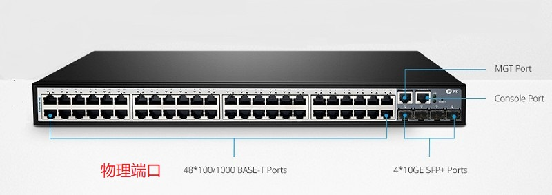


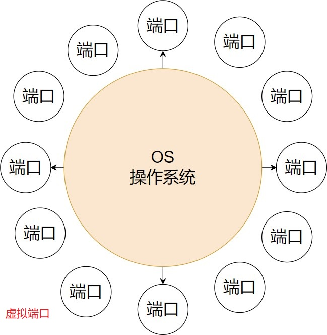


物理端口我们日常生活中经常见到，也能知晓它的作用。但是虚拟端口，有什么用？为什么需要它呢？


计算机程序之间的通讯，通过 IP 只能锁定计算机，但是无法锁定具体的程序。

通过端口可以锁定计算机上具体的程序，确保程序之间进行沟通

IP地址相当于小区地址，在小区内可以有许多住户（程序），而门牌号（端口）就是各个住户（程序）的联系地址

Linux 系统是一个超大号小区，可以支持 65535 个端口，这 6 万多个端口分为 3 类进行使用：

1. 公认端口： 1\~1023 ，通常用于一些系统内置或知名程序的预留使用，如 SSH 服务的 22 端口， HTTPS 服务的 443 端口

> 非特殊需要，不要占用这个范围的端口

2. 注册端口： 1024\~49151 ，通常可以随意使用，用于松散的绑定一些程序 \\ 服务

3. 动态端口： 49152\~65535，通常不会固定绑定程序，而是当程序对外进行网络链接时，用于临时使用。


如图中，计算机 A 的微信连接计算机 B 的微信， A 使用的 50001 即动态端口，临时找一个端口作为出口

计算机B 的微信使用端口 5678，即注册端口，长期绑定此端口等待别人连接

PS ：上述微信的端口仅为演示，具体微信的端口使用非图中示意

### 查看端口占用

可以通过 Linux 命令去查看端口的占用情况

#### nmap命令

使用nmap 命令，安装 nmap ： yum -y install nmap

语法： `nmap 被查看的IP地址`

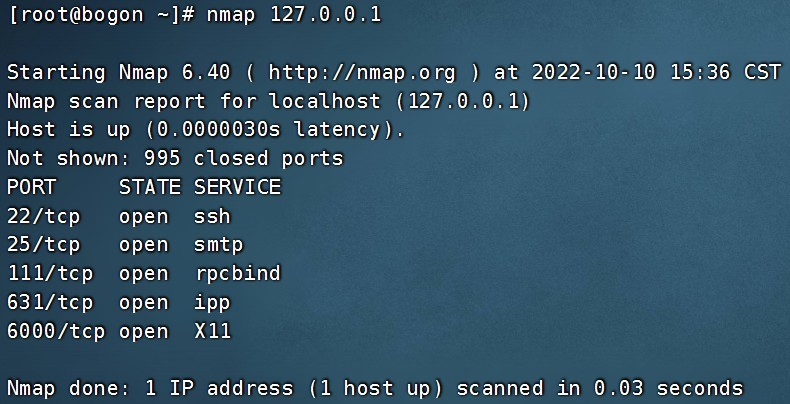

可以看到，本机（ 127.0.0.1 ）上有 5 个端口现在被程序占用了。其中：

-   22 端口，一般是 SSH 服务使用，即 FinalShell 远程连接 Linux 所使用的端口

#### netstat命令

可以通过 netstat 命令，查看指定端口的占用情况

语法： `netstat -anp \| grep 端口号`

安装 netstat ： yum -y install net-tools

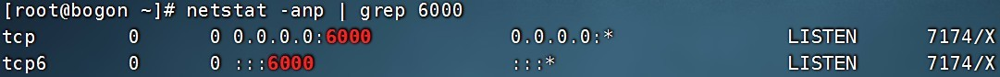

如图，可以看到当前系统 6000 端口被程序（进程号 7174 ）占用了

其中， 0.0.0.0:6000 ，表示端口绑定在 0.0.0.0 这个 IP 地址上，表示允许外部访问

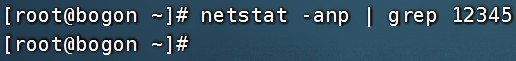

可以看到，当前系统 12345 端口无人使用。

### 总结

1. 什么是端口？

端口是指计算机和外部交互的出入口，可以分为物理端口和虚拟端口

-   物理端口： USB 、 HDMI 、 DP 、 VGA 、 RJ45 等

-   虚拟端口：操作系统和外部交互的出入口

IP 只能确定计算机，通过端口才能锁定要交互的程序

2. 端口的划分

-   公认端口： 1\~1023 ，用于系统内置或常用知名软件绑定使用

-   注册端口： 1024\~49151 ，用于松散绑定使用（用户自定义）

-   动态端口： 49152\~65535 ，用于临时使用（多用于出口）

3. 查看端口占用

-   `nmap IP 地址`，查看指定 IP 的对外暴露端口

-   `netstat -anp \| grep 端口号`，查看本机指定端口号的占用情况

# 八、进程管理

## 进程

程序运行在操作系统中，是被操作系统所管理的。

为管理运行的程序，每一个程序在运行的时候，便被操作系统注册为系统中的一个：进程

并会为每一个进程都分配一个独有的：进程 ID （进程号）

Windows 系统任务管理器：

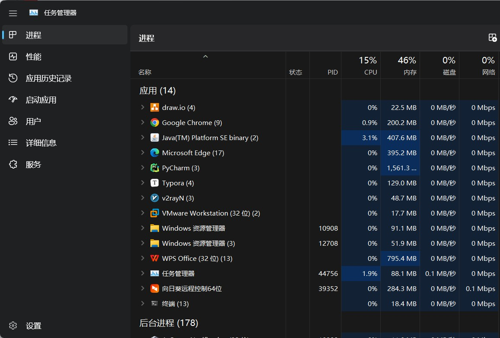

Linux 系统查看进程：

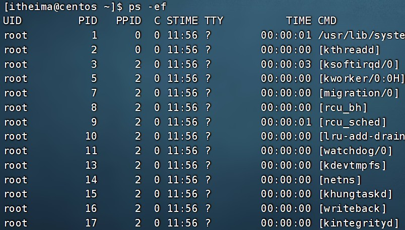

## 查看进程

可以通过 ps 命令查看 Linux 系统中的进程信息

语法： `ps [-e -f]`

选项： -e ，显示出全部的进程

选项： -f，以完全格式化的形式展示信息（展示全部信息)

一般来说，固定用法就是：ps -ef 列出全部进程的全部信息

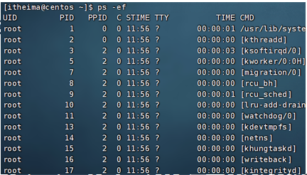

从左到右分别是：

-   **UID ：进程所属的用户 ID**

-   **PID ：进程的进程号 ID**

-   **PPID ：进程的父 ID （启动此进程的其它进程）**

-   **C ：此进程的 CPU 占用率（百分比）**

-   **STIME ：进程的启动时间**

-   **TTY ：启动此进程的终端序号，如显示 ? ，表示非终端启动**

-   **TIME ：进程占用 CPU 的时间**

-   **CMD ：进程对应的名称或启动路径或启动命令**

## 查看指定进程

-   在 FinalShell 中，执行命令： tail ，可以看到，此命令一直阻塞在那里

-   在FinalShell 中，复制一个标签页，执行： ps -ef 找出 tail 这个程序的进程信息
    
-   问题：是否会发现，列出的信息太多，无法准确的找到或很麻烦怎么办？

我们可以使用管道符配合 grep 来进行过滤，如： ps -ef \| grep tail，即可准确的找到 tail 命令的信息

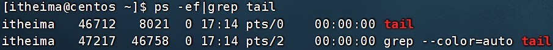

过滤不仅仅过滤名称，进程号、用户 ID 等等，都可以被 grep 过滤

如： ps -ef \| grep 30001 ，过滤带有 30001 关键字的进程信息（一般指代过滤 30001 进程号）

## 关闭进程

在 Windows 系统中，可以通过任务管理器选择进程后，点击结束进程从而关闭它。

同样，在 Linux 中，可以通过 kill 命令关闭进程。

语法：`kill [-9] 进程ID`

选项： -9，表示强制关闭进程。不使用此选项会向进程发送信号要求其关闭，但是否关闭看进程自身的处理机制。

示例：

* 使用 kill 命令不带 -9 选项


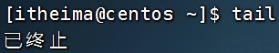

* 使用 kill 命令带 -9 选项

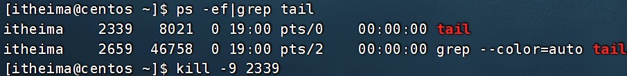


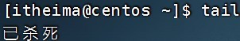

## 总结

1. 什么是进程？

进程是指程序在操作系统内运行后被注册为系统内的一个进程，并拥有独立的进程 ID（进程号）

2. 管理进程的命令

-   `ps -ef`：查看进程信息

-   `ps -ef \| grep 关键字`：过滤指定关键字进程信息

-   `kill \[-9\] 进程号`：关闭指定进程号的进程

# 九、主机状态

## 查看系统资源占用

可以通过 top 命令查看 CPU 、内存使用情况，类似 Windows 的任务管理器

默认每 5 秒刷新一次，语法：直接输入 top 即可，按 q 或ctrl + c 退出

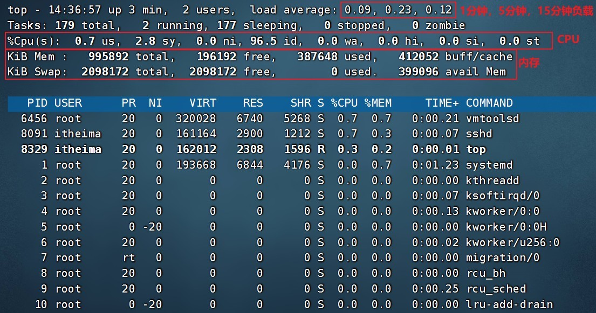

## top 命令内容详解


-   第一行：
    -   top：命令名称
    -   14:39:58：当前系统时间
    -   up 6 min：启动了 6 分钟
    -   2 users： 2 个用户登录
    -   load：1、5、15 分钟平均负载（几颗 CPU 百分百繁忙）


-   第二行：
    -   Tasks：175 个进程
    -   1 running：1个进程正在运行
    -   174 sleeping：174 个进程睡眠
    -   ）stopped：0 个停止进程
    -   0 zombie：0 个僵尸进程


-   第三行：
    * %Cpu(s)：CPU 使用率
    * us：用户 CPU 使用率
    * sy：系统 CPU 使用率
    * ni：高优先级进程占用 CPU 时间百分比
    * id：空闲 CPU 率
    * wa： IO 等待 CPU 占用率
    * hi：CPU 硬件中断率
    * si：CPU 软件中断率
    * st：强制等待占用 CPU 率


-   第四、五行：
    * Kib Mem：物理内存，total：总量，free：空闲，used：使用，buff/cache： buff 和 cache 占用
    * Kib Swap：虚拟内存（交换空间），total：总量，free：空闲，used：使用，buff/cache：buff 和 cache 占用


-   PID ：进程 id

-   USER ：进程所属用户

-   PR ：进程优先级，越小越高

-   NI ：负值表示高优先级，正表示低优先级

-   VIRT ：进程使用虚拟内存，单位 KB

-   RES ：进程使用物理内存，单位 KB

-   SHR ：进程使用共享内存，单位 KB

-   S ：进程状态（ S 休眠， R 运行， Z 僵死状态， N 负数优先级， I 空闲状态）
    
-   %CPU ：进程占用 CPU 率

-   %MEM ：进程占用内存率

-   TIME+ ：进程使用 CPU 时间总计，单位 10 毫秒

-   COMMAND ：进程的命令或名称或程序文件路径

## top 命令选项

top 命令也支持选项：


## top 交互式选项

当top 以交互式运行（非 -b 选项启动），可以用以下交互式命令进行控制

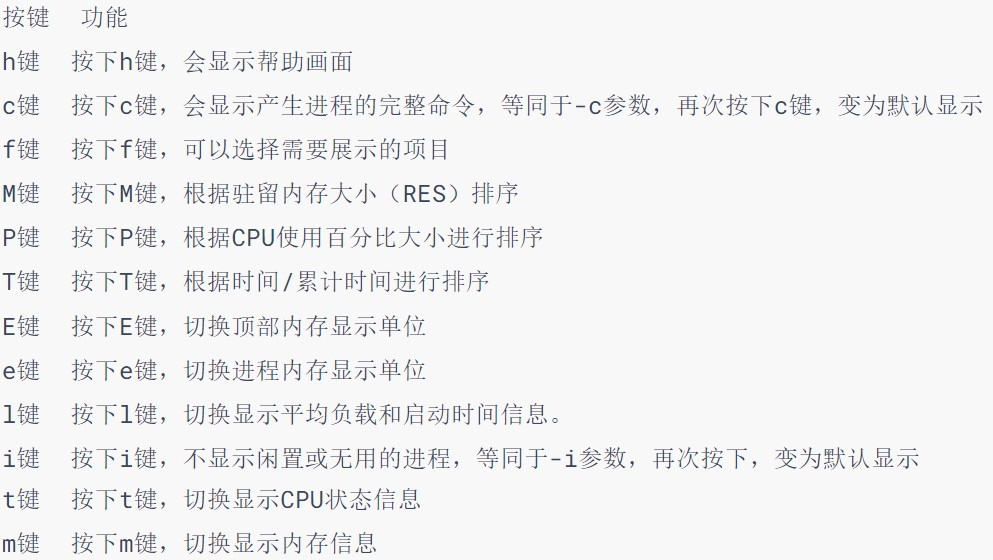

## 磁盘信息监控

* 使用df 命令，可以查看硬盘的使用情况

语法：`df [-h]`

选项：-h，以更加人性化的单位显示


-   可以使用 iostat 查看CPU 、磁盘的相关信息

语法：`iostat [-x] [num1] [num2]`

选项：-x，显示更多信息

num1：数字，刷新间隔，num2：数字，刷新几次

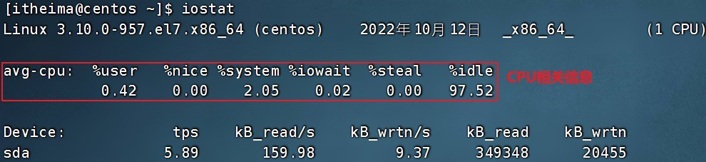

tps ：该设备每秒的传输次数（ Indicate the number of transfers per second that were issued to the device. ）。

\" 一次传输\" 意思是 \"一次I/O 请求\" 。多个逻辑请求可能会被合并为 \" 一次I/O 请求\" 。\"一次传输\" 请求的大小是未知的。

-   使用iostat 的-x 选项，可以显示更多信息

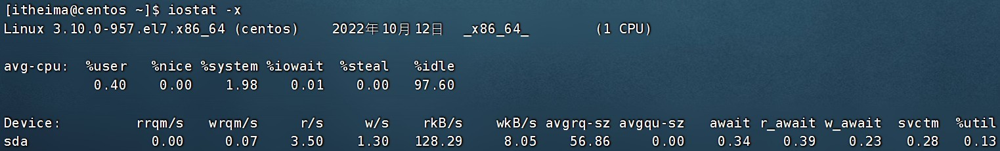

* rrqm/s： 每秒这个设备相关的读取请求有多少被 Merge 了（当系统调用需要读取数据的时候，VFS 将请求发到各个 FS ，如果 FS 发现不同的读取请求读取的是相同 Block 的数据， FS会将这个请求合并 Merge, 提高 IO 利用率，避免重复调用）

* wrqm/s ： 每秒这个设备相关的写入请求有多少被 Merge 了
* rsec/s ：每秒读取的扇区数； sectors

* wsec/ ：每秒写入的扇区数

* **rKB/s ： 每秒发送到设备的读取请求数**
* **wKB/s ：每秒发送到设备的写入请求数**
* avgrq-sz：平均请求扇区的大小

* avgqu-sz：平均请求队列的长度。毫无疑问，队列长度越短越好
* await ：每一个 IO 请求的处理的平均时间（单位是微秒毫秒）
* svctm：表示平均每次设备 I/O 操作的服务时间（以毫秒为单位）

* **%util ： 磁盘利用率**

## 网络状态监控

-   可以使用 sar 命令查看网络的相关统计（ sar  命令非常复杂，这里仅简单用于统计网络）

语法：`sar -n DEV num1 num2`

选项： -n ，查看网络， DEV 表示查看网络接口

num1：刷新间隔（不填就查看一次结束），num2：查看次数（不填无限次数）

如图，查看2次，隔3秒刷新一次，并最终汇总平均记录：

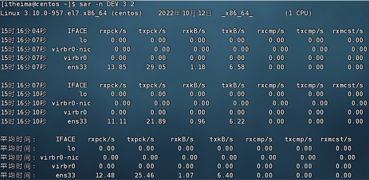

**信息解读：**

-   IFACE：本地网卡接口的名称

-   rxpck/s：每秒钟接受的数据包

-   txpck/s：每秒钟发送的数据包

-   **rxKB/S：每秒钟接受的数据包大小，单位为 KB**

-   **txKB/S：每秒钟发送的数据包大小，单位为 KB**

-   rxcmp/s：每秒钟接受的压缩数据包

-   txcmp/s：每秒钟发送的压缩包

-   rxmcst/s：每秒钟接收的多播数据包

## 总结

1. 使用 top 命令可以：

-   类似Windows 任务管理器

-   查看CPU 、内存、进程的信息

2. 使用 df 命令可以：

-   查看磁盘使用率

3. 使用 iostat 可以：

-   查看磁盘速率等信息

4. 使用 sar -n DEV 命令可以：

-   查看网络情况

# 十、环境变量

## 环境变量

在讲解 which 命令的时候，我们知道使用的一系列命令其实本质上就是一个个的可执行程序。

比如，cd 命令的本体就是： /usr/bin/cd 这个程序文件。

我们是否会有疑问，为何无论当前工作目录在哪里，都能执行：/usr/bin/cd 这个程序呢？

这就是环境变量的作用。

环境变量是操作系统（ Windows 、 Linux 、 Mac）在运行的时候，记录的一些关键性信息，用以辅助系统运行。

在 Linux 系统中执行： env 命令即可查看当前系统中记录的环境变量

环境变量是一种 KeyValue 型结构，即名称和值，如下图：

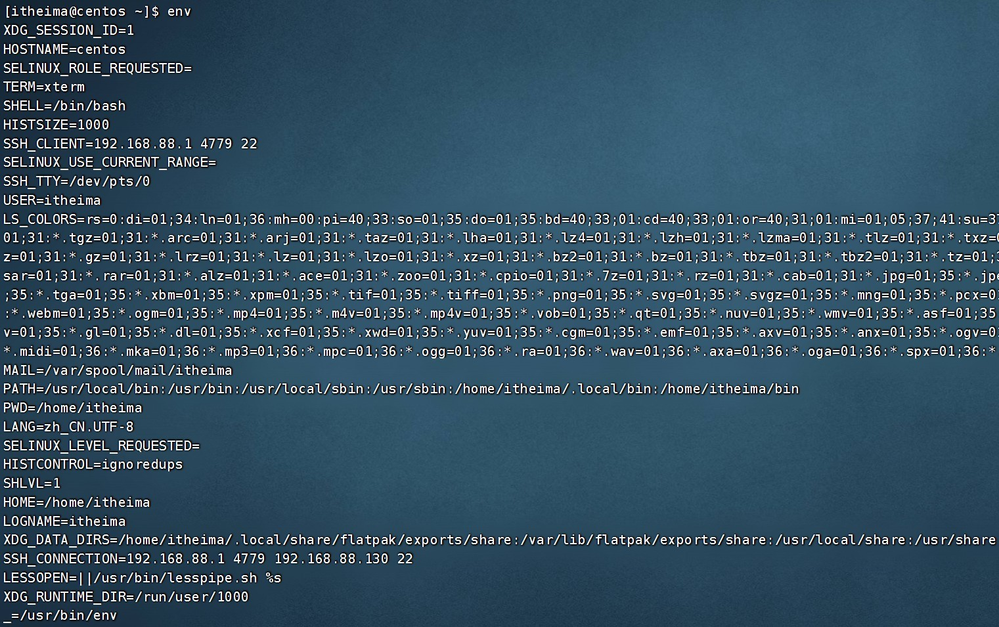

如图，图中记录了：

-   HOME ： /home/itheima ，用户的 HOME 路径

-   USER ： itheima ，当前的操作用户

-   PWD ：当前工作路径

-   ...\... 等等一系列信息，用于辅助系统在运行的时候从环境变量中获取关键信息

## 环境变量： PATH

在前面提出的问题中，我们说无论当前工作目录是什么，都能执行 /usr/bin/cd 这个程序，这个就是借助环境变量中 PATH 这个项目的值来做到的。

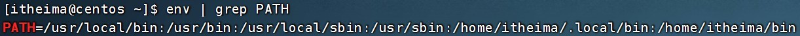

PATH 记录了系统执行任何命令的搜索路径，如上图记录了（路径之间以 : 隔开）：

-   /usr/local/bin

-   /usr/bin

-   /usr/local/sbin

-   /usr/sbin

-   /home/itheima/.local/bin

-   /home/itheima/bin

当执行任何命令，都会按照顺序，从上述路径中搜索要执行的程序的本体

比如执行 cd 命令，就从第二个目录 /usr/bin 中搜索到了 cd 命令，并执行

## \$ 符号

在 Linux 系统中， $ 符号被用于取"变量"的值。

环境变量记录的信息，除了给操作系统自己使用外，如果我们想要取用，也可以使用。

取得环境变量的值就可以通过语法：`$ 环境变量名` 来取得

比如： echo \$PATH 就可以取得 PATH 这个环境变量的值，并通过 echo 语句输出出来。

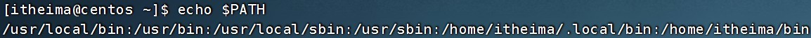

又或者： echo \${PATH}ABC


当和其它内容混合在一起的时候，可以通过 { } 来标注取的变量是谁

## 自行设置环境变量

Linux 环境变量可以用户自行设置，其中分为：

-   临时设置，语法： `export 变量名 = 变量值`

-   永久生效

    -   针对当前用户生效，配置在当前用户的：\~/.bashrc 文件中

    -   针对所有用户生效，配置在系统的： /etc/profile 文件中

    -   并通过语法： `source 配置文件`，进行立刻生效，或重新登录 FinalShell 生效


## 自定义环境变量 PATH

环境变量 PATH 这个项目里面记录了系统执行命令的搜索路径。这些搜索路径我们也可以自行添加到 PATH 中去。

测试：

-   在当前 HOME 目录内创建文件夹 myenv ，在文件夹内创建文件 mkhaha

-   通过vim 编辑器，在 mkhaha 文件内填入： echo 哈哈哈哈哈

完成上述操作后，随意切换工作目录，执行 mkhaha 命令尝试一下，会发现无法执行

-   修改PATH 的值

临时修改PATH： export PATH=\$PATH:/home/itheima/myenv ，再次执行 mkhaha ，无论在哪里都能执行了

或将 export PATH=\$PATH:/home/itheima/myenv，填入用户环境变量文件或系统环境变量文件中去

## 总结

1. 什么是环境变量？

环境变量是一组信息记录，类型是 KeyValue 型（名称= 值)，用于操作系统运行的时候记录关键信息

2. 通过 env 命令可以查看当前系统配置的环境变量信息

3. 通过 \$ 符号，可以取出环境变量的值

4. 什么是 PATH ，作用是？

环境变量 PATH 会记录一组目录，目录之间用 : 隔开。这里记录的是命令的搜索路径，当执行命令会从记录中记录的目录中挨个搜索要执行的命令并执行。

可以通过修改这个项目的值，加入自定义的命令搜索路径。如 export PATH=\$PATH: 自定义路径

5. 如何修改环境变量？

-   临时生效： `export 名称= 值`

-   永久生效：

    -   针对用户： \~/.bashrc 文件中配置

    -   针对全部用户： /etc/profile 文件中配置

    -   配置完成，可以通过 source 命令立刻生效

# 十一、上传、下载

## 上传、下载

我们可以通过 FinalShell 工具，方便的和虚拟机进行数据交换。

在FinalShell 软件的下方窗体中，提供了 Linux 的文件系统视图，可以方便的：

-   浏览文件系统，找到合适的文件，右键点击下载，即可传输到本地电脑

-   浏览文件系统，找到合适的目录，将本地电脑的文件拓展进入，即可方便的上传数据到 Linux 中


## rz 、 sz 命令

当然，除了通过 FinalShell 的下方窗体进行文件的传输以外，也可以通过 rz、sz 命令进行文件传输。 

rz 、 sz 命令需要安装，可以通过： yum -y install lrzsz ，即可安装。

-   rz 命令，进行上传，语法：直接输入 rz 即可

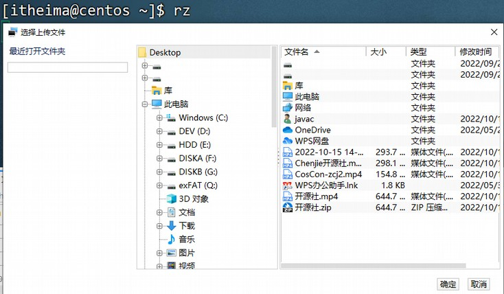

-   sz 命令进行下载，语法： sz 要下载的文件


文件会自动下载到桌面的： fsdownload 文件夹中。

注意， rz 、sz 命令需要终端软件支持才可正常运行

FinalShell 、 SecureCRT 、 XShell 等常用终端软件均支持此操作

## 总结

1. 如何使用 FinalShell 对Linux 系统进行上传下载操作？ 


2. rz 、sz 命令

-   通过 yum -y install lrzsz 可以安装此命令

-   rz 进行文件上传

-   sz 文件，进行文件下载

# 十二、压缩、解压


> Learning Objectives

1.  掌握使用 tar 命令压缩或解压 tar 或gzip 文件

2.  掌握使用 zip 、 unzip 命令压缩或解压 zip 文件


## 压缩格式 {#压缩格式 .unnumbered}

> 市面上有非常多的压缩格式

-   zip 格式： Linux 、 Windows 、 MacOS ，常用

-   7zip ： Windows 系统常用

-   rar ： Windows 系统常用

-   tar ： Linux 、 MacOS 常用

-   gzip ： Linux 、 MacOS 常用

> 在Windows 系统中常用的软件如： winrar 、 bandizip
> 等软件，都支持各类常见的压缩格式，这里不多做讨论。我们现在要学习，如何在
> Linux 系统中操作： tar 、 gzip 、 zip 这三种压缩格式
>
> 完成文件的压缩、解压操作。

高级软件人才培训专家

## tar 命令 {#tar-命令 .unnumbered}

> Linux 和 Mac 系统常用有 2 种压缩格式，后缀名分别是：

-   .tar ，称之为 tarball ，归档文件，即简单的将文件组装到一个 .tar
    的文件内，并没有太多文件体积的减少，仅仅是

> 简单的封装

-   .gz ，也常见为 .tar.gz ， gzip 格式压缩文件，即使用 gzip
    压缩算法将文件压缩到一个文件内，可以极大的减少压缩

> 后的体积
>
> 针对这两种格式，使用 tar 命令均可以进行压缩和解压缩的操作
>
> 语法：

-   -c ，创建压缩文件，用于压缩模式

-   -v ，显示压缩、解压过程，用于查看进度

-   {width="4.430555555555555in"
    height="0.3333333333333333in"}-x ，解压模式

-   -f ，要创建的文件，或要解压的文件， -f
    选项必须在所有选项中位置处于最后一个

-   -z ， gzip 模式，不使用 -z 就是普通的 tarball 格式

-   -C ，选择解压的目的地，用于解压模式

{width="1.7263877952755906in"
height="1.726388888888889in"}高级软件人才培训专家


## tar 命令压缩 {#tar-命令压缩 .unnumbered}

> tar 的常用组合为：

-   tar -cvf test.tar 1.txt 2.txt 3.txt

> 将 1.txt 2.txt 3.txt 压缩到 test.tar 文件内

-   tar -zcvf test.tar.gz 1.txt 2.txt 3.txt

> 将 1.txt 2.txt 3.txt 压缩到 test.tar.gz 文件内，使用 gzip 模式
>
> 注意：

-   -z 选项如果使用的话，一般处于选项位第一个

-   -f 选项，必须在选项位最后一个

高级软件人才培训专家

## tar 解压 {#tar-解压 .unnumbered}

> 常用的 tar 解压组合有

-   tar -xvf test.tar

> 解压 test.tar ，将文件解压至当前目录

-   tar -xvf test.tar -C /home/itheima

> 解压 test.tar ，将文件解压至指定目录（ /home/itheima ）

-   tar -zxvf test.tar.gz -C /home/itheima

> 以Gzip 模式解压 test.tar.gz ，将文件解压至指定目录（ /home/itheima ）
>
> 注意：

-   -f 选项，必须在选项组合体的最后一位

-   -z 选项，建议在开头位置

-   -C 选项单独使用，和解压所需的其它参数分开

{width="1.4291655730533683in"
height="1.6291666666666667in"}高级软件人才培训专家


## zip 命令压缩文件 {#zip-命令压缩文件 .unnumbered}

> 可以使用 zip 命令，压缩文件为 zip 压缩包
>
> {width="2.6041655730533684in"
> height="0.30138779527559056in"}语法：

-   -r ，被压缩的包含文件夹的时候，需要使用 -r 选项，和 rm 、 cp
    等命令的 -r 效果一致

> 示例：

-   zip test.zip a.txt b.txt c.txt

> 将a.txt b.txt c.txt 压缩到 test.zip 文件内

-   zip -r test.zip test itheima a.txt

> 将test 、 itheima 两个文件夹和 a.txt 文件，压缩到 test.zip 文件内

高级软件人才培训专家


## unzip 命令解压文件 {#unzip-命令解压文件 .unnumbered}

> 使用unzip 命令，可以方便的解压 zip 压缩包
>
> {width="1.4583333333333333in"
> height="0.2916666666666667in"}语法：

-   -d ，指定要解压去的位置，同 tar 的-C 选项

-   参数，被解压的 zip 压缩包文件

> 示例：

-   unzip test.zip ，将 test.zip 解压到当前目录

-   unzip test.zip -d /home/itheima ，将test.zip 解压到指定文件夹内（
    /home/itheima ）

高级软件人才培训专家

### Linux 系统常用的压缩格式有：

-   tar
    > 格式，归档文件，简单的将文件整合到一个文件内，无压缩效果

-   gzip 格式， gzip 压缩文件，不仅能整合到一个文件，同时有体积压缩效果

### tar 命令

> tar \[-z -x -v -c -f -C\] 参数 \...

-   -c ，创建压缩文件、 -v ，查看压缩 \\ 解压过程、 -x ，解压模式

-   -f ，指定压缩 \\ 解压的文件， -z ， gzip 模式， -C ，指定解压的路径

-   -z 在选项组建议在开头， -f 在选项组内必须在尾部， -C 单独使用

### zip 命令

> zip \[-r\] 参数 \...

-   -r ，压缩文件夹使用

### unzip 命令

> unzip \[-d\] 参数

-   -d ，指定解压去的目录

高级软件人才培训专家

> {width="2.4960629921259843in"
> height="1.030207786526684in"}
